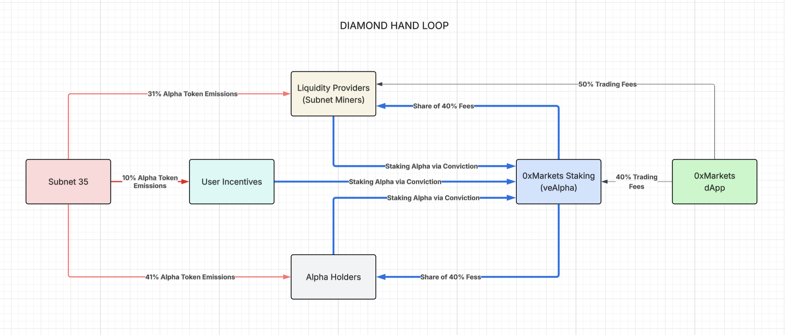

# Staking & Governance (veALPHA)

Holding Alpha already earns you the network's validator yield. **Staking** your Alpha on 0xMarkets adds a second income stream on top — a share of the exchange's trading fees — and mints you **veALPHA**, the token that gives you a vote in how the exchange is run.

In short: stake Alpha, earn two ways, and help govern the protocol.

> **Status.** Staking runs on Bittensor's **conviction** mechanism, which is live at the network level. The 0xMarkets staking interface and the first version of veALPHA governance are rolling out progressively. 

***

## How it works

Staking on 0xMarkets is built on **conviction**, a Bittensor mechanism that lets you lock Alpha to a subnet for a chosen period. The flow is four steps:

1. **You stake Alpha on 0xMarkets.** Under the hood, this locks your Alpha to conviction, directed at the **0xMarkets owner key** on Bittensor Subnet 35. Anyone staking through 0xMarkets is delegating their conviction to that key — you don't have to manage any of it manually.
2. **Your stake produces a conviction score.** Bittensor weights your locked amount by how long you lock it for (see [What conviction is](#what-conviction-is) below), and tracks the result as a single score.
3. **0xMarkets reads your score via the conviction API** and uses it to size your share of the staking rewards pool — the larger your score relative to everyone else's, the larger your slice.
4. **You're minted veALPHA** in proportion to your score, which gives you governance rights over the exchange.

***

## Two-sided rewards

Staking pays you from two independent sources at the same time:

| Reward | Paid in | Where it comes from |
|---|---|---|
| **Validator yield** | Alpha | Bittensor's native staking dividends — earned on your Alpha for being staked, the same yield any staked Alpha accrues. |
| **Trading-fee share** | USDC | **40% of all trading fees** generated on the 0xMarkets exchange flow into a staking pool and are split among stakers by conviction score. |

You keep the first simply by holding and staking Alpha. You earn the second on top, funded directly by exchange activity. The two stack — which is why **staking your Alpha is the way to maximise your yield**, and why the more the exchange trades, the more valuable staking becomes.

> The 40% staking share is one slice of how every trading fee is split across the protocol (LP pool, stakers, treasury). For the full breakdown, see [Fees & rewards](../how-it-works/fees-and-rewards.md).

> **LPs have the highest earning potential.** Liquidity providers already earn LP yield (a share of trading fees plus Alpha emissions). By staking the Alpha they earn, they collect **staking yield on top** — earning from both sides of the protocol at once. See [Providing Liquidity](../liquidity/README.md) for how LP yield works.

***

## What conviction is

Conviction is Bittensor's way of measuring committed stake. The core idea is simple:

```
conviction ≈ amount staked × lock time
```

- You lock Alpha for a **chosen duration**. A larger amount and a longer lock both raise your score.
- Your score starts at the full value of what you lock and **decays as the lock approaches expiry** — commitment that's about to end counts for less than commitment with time left on it.
- The network **recalculates scores periodically** (on a ~30-day cadence, smoothed with a moving average), so your share adjusts over time rather than being fixed at the moment you stake.

This is what makes staking fair: rewards and voting weight track genuine, time-backed commitment, not just whoever shows up with the most tokens for a moment.

### Unlocking

Unstaking follows Bittensor's standard conviction rules — 0xMarkets adds no layer of its own. You request an unlock, and the stake then becomes withdrawable over an extended decay period rather than instantly: roughly **90% of your stake is withdrawable after ~12 months**. Locking is a real commitment, so stake with that timeline in mind.

***

## Your share of the staking pool

The staking pool is funded by **40% of the exchange's trading fees**, distributed in **USDC**. Your share each epoch is your conviction score as a fraction of everyone's:

```
your_reward = staking_pool × (your_conviction / total_conviction)
```

Because the pool is fed by real trading volume and split by committed stake, it anchors Alpha's value to what the exchange actually earns: the busier the exchange, the larger the pool every staker draws from.

Rewards accrue to your stake each epoch and are **claimed manually in USDC** through the 0xMarkets interface — they sit unclaimed until you withdraw them.

***

## veALPHA & governance

When you stake, you're minted **veALPHA** in proportion to your conviction score. veALPHA is:

- **Non-transferable** — it's bound to your wallet and can't be sold or moved.
- **Score-linked** — your veALPHA reflects your conviction score, so it grows as you commit more or longer, and adjusts as scores are recalculated. `[TBD: confirm veALPHA tracks score dynamically vs. minted once at stake]`

veALPHA is your governance weight over the exchange.

### Governance v1 — fee distribution

The first version of governance gives veALPHA holders control over **how the exchange's trading fees are distributed**. Every trading fee is split across four destinations. These are the launch values:

| Destination | Launch | Minimum (floor) |
|---|---|---|
| **LP pool** | 50% | 30% |
| **Staking pool** | 40% | 30% |
| **Treasury** | 10% | 10% |
| **Alpha buyback** | 0% | — |

veALPHA holders vote to **change this split**, with one constraint: no destination can be pushed below its floor. The floors guarantee that liquidity providers, stakers, and protocol operations are always funded — 70% of every fee is protected by the minimums, leaving **30% that governance can reallocate** across the four buckets (including turning on the Alpha buyback).

For example, holders could vote to lift the staking pool to 50% and route 10% to buyback, as long as LPs stay at or above 30%, stakers at or above 30%, and treasury at or above 10%, and the four shares total 100%.

This puts the most important economic lever — who gets what share of fee revenue — directly in the hands of the people who've committed to the network, without letting any single group be starved.

> **Governance expands over time.** Fee-distribution voting is the first release. The next step is **LP pool weights** — letting veALPHA holders steer how liquidity incentives are allocated. `[TBD: LP pool weight specs]`

***

## Why hold Alpha

Putting it together:

- **Hold Alpha** → earn native validator yield.
- **Stake it on 0xMarkets** → add a USDC share of exchange trading fees on top, sized by your conviction.
- **Get veALPHA** → vote on how the exchange distributes its fees.

Each piece reinforces the next: more committed stake deepens the network, more trading grows the fee pool, and governance lets stakers steer the economics in their favour. Holding and staking Alpha is how you sit on every side of that loop.



## Next

- [Alpha Token](README.md)
- [Fees & rewards](../how-it-works/fees-and-rewards.md)
- [Weekly epochs](../how-it-works/weekly-epochs.md)
