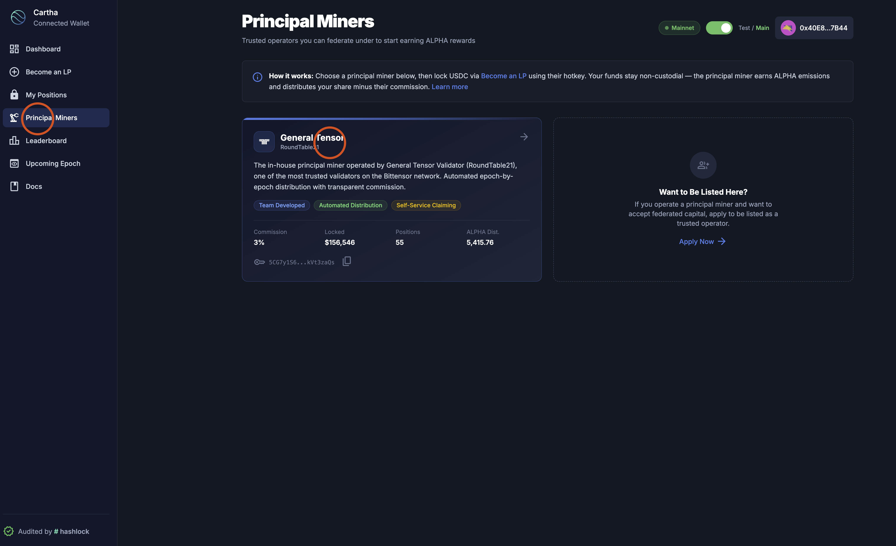
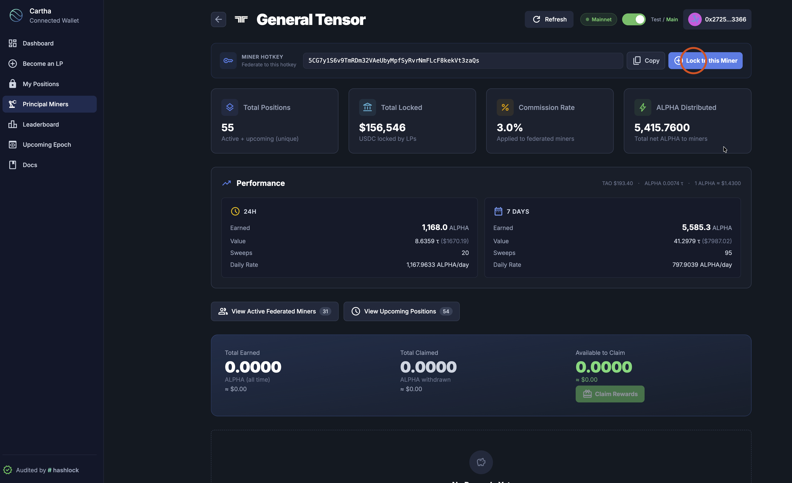
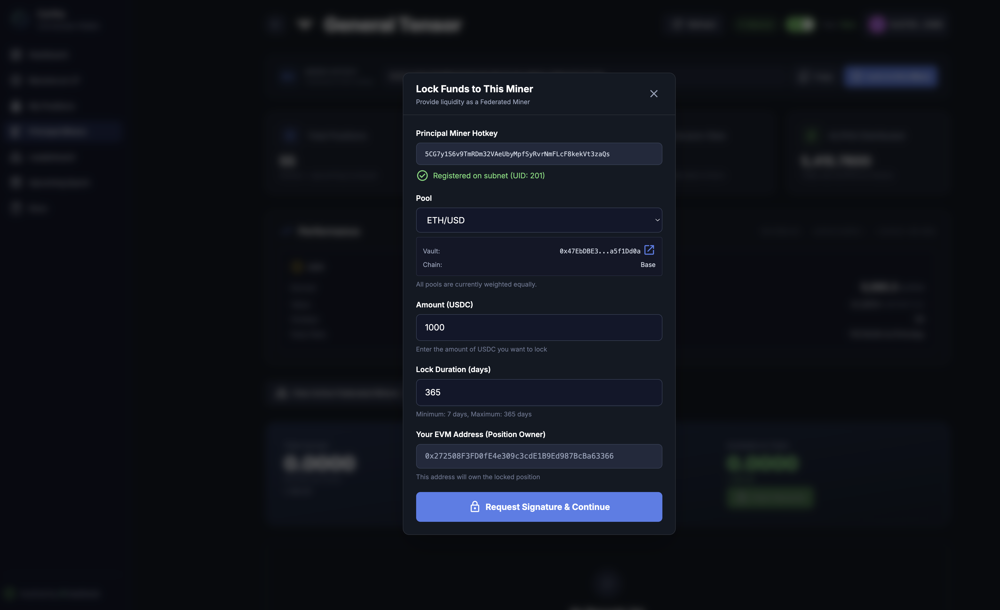

# Deposit via Trusted Principal Miner

The easiest way to start earning as a federated miner — browse verified principal miners, review their stats and commission rates, and lock your funds directly from their dashboard.

> Make sure you've completed [Step 1: Set Up Your Wallet](federated-miner-guide.md#step-1-set-up-your-wallet) before continuing.

---

## How It Works

The **Principal Miners** page lists trusted, verified miners that have been approved to accept federated capital. Each principal miner shows their performance stats, commission rate, and total positions — so you can make an informed choice before locking your USDC.

Principal miners charge a **commission** (e.g. 3%) on the ALPHA rewards your position earns. In return, they handle subnet registration, run infrastructure, and manage automated reward distribution to their federated miners.

---

## Step-by-Step

### 1. Connect Your Wallet

1. Go to [https://cartha.finance](https://cartha.finance)
2. Click **"Connect Wallet"** in the top right corner and select your wallet provider
3. Make sure you're connected to **Base Mainnet** network

### 2. Browse Principal Miners

4. Click **"Principal Miners"** in the left navigation bar
5. You'll see a list of trusted principal miners with their stats:
   - **Commission** — The percentage taken from your rewards
   - **Locks** — Total USDC locked under this miner
   - **Positions** — Number of active federated miner positions
   - **ALPHA Dist** — Total ALPHA distributed to miners to date

6. **Choose a principal miner** by clicking on their card

### 3. Review the Miner & Lock

7. You'll see the principal miner's full dashboard with detailed performance metrics (24H and 7-day earnings, daily rate, total positions, etc.)

8. Click the **"Lock to this Miner"** button in the top right corner

### 4. Enter Your Lock Details

9. The **"Lock Funds to This Miner"** modal will appear with the principal miner's hotkey pre-filled and verified. Fill in:
   - **Pool** — Select which trading pair to provide liquidity for (ETH/USD, BTC/USD, etc.)
   - **Amount (USDC)** — How much USDC you want to lock
   - **Lock Duration (days)** — Minimum 7 days, maximum 365 days. Longer locks = higher deposit score = larger share of rewards
   - **Your EVM Address** — Auto-filled with your connected wallet

10. Click **"Request Signature & Continue"**

### 5. Approve & Confirm

11. **Approve USDC** — Your wallet will prompt you to approve the vault contract to spend your USDC. Confirm the transaction (requires a small gas fee in ETH).

12. **Lock Position** — After approval, confirm the second transaction to lock your USDC in the vault.

### 6. Verify Your Position

13. **Wait for confirmation** — It may take 30 seconds to 5 minutes for the position to be processed by the verifier.

14. **View your position** — Navigate to **"My Positions"** in the sidebar to see your active lock. You'll see the pool, principal miner hotkey, lock status, amounts, expiration date, and options to Extend or Top Up.

---

## Why Choose a Trusted Principal Miner?

| Benefit | Detail |
|---------|--------|
| **No hotkey needed** | The miner's hotkey is pre-filled — no copying or searching |
| **Verified & trusted** | Only approved miners are listed on the Principal Miners page |
| **Transparent stats** | See commission rate, performance, and total positions before you commit |
| **Automated rewards** | Trusted miners run automated reward distribution systems |
| **Self-service claiming** | Claim your ALPHA rewards directly from the dashboard |

## Understanding Commission

Principal miners charge a commission on the ALPHA rewards earned by federated miners under them. For example:

- If you earn **100 ALPHA** and the commission rate is **3%**, you receive **97 ALPHA** net
- Commission is automatically deducted — you always see your net reward in the dashboard
- Different miners may have different commission rates — compare before choosing

---

## Next Steps

Once your funds are locked, continue with the main guide:

- **[Step 3: Principal Miner Dashboard](federated-miner-guide.md#step-3-principal-miner-dashboard)** — Monitor your position and earnings
- **[Step 4: Claim ALPHA Rewards](federated-miner-guide.md#step-4-claim-alpha-rewards)** — Withdraw your earned ALPHA
- **[Managing Your Position](federated-miner-guide.md#managing-your-position)** — Top up, extend, or withdraw
