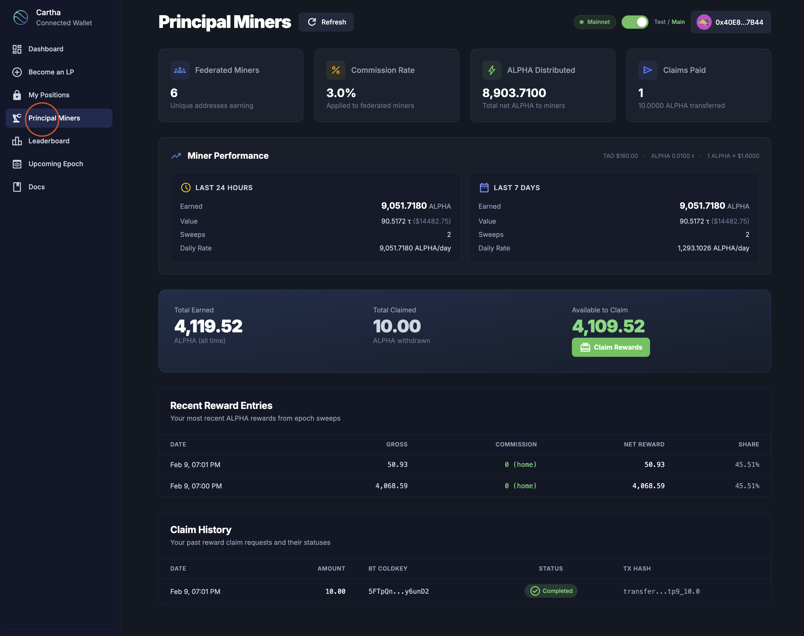
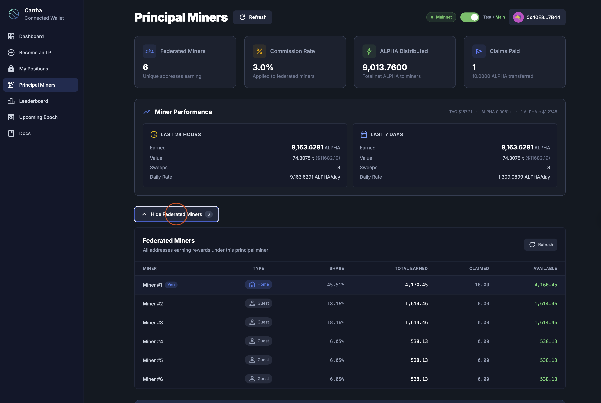
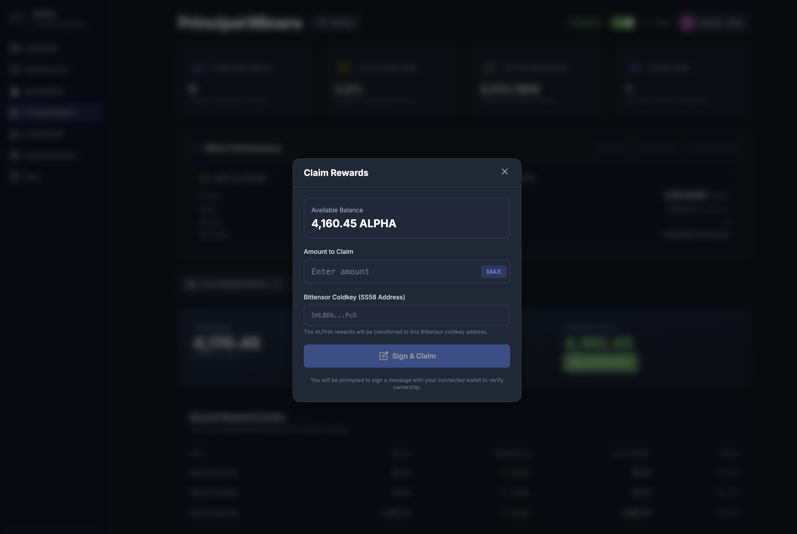
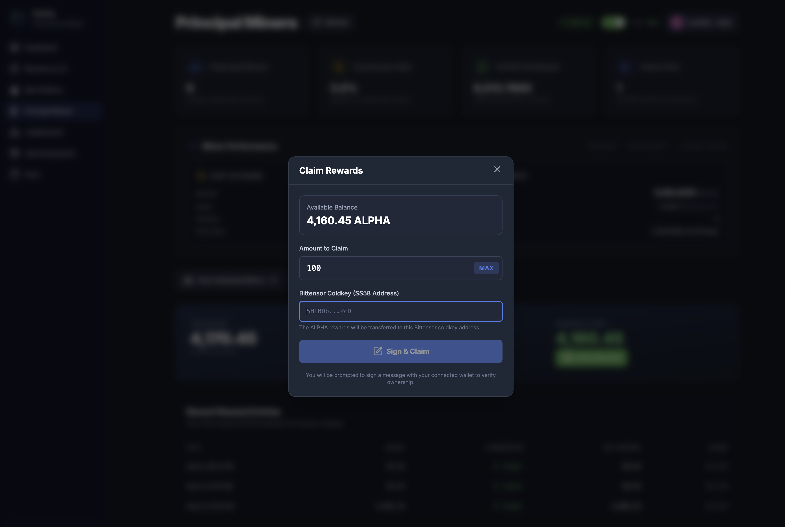
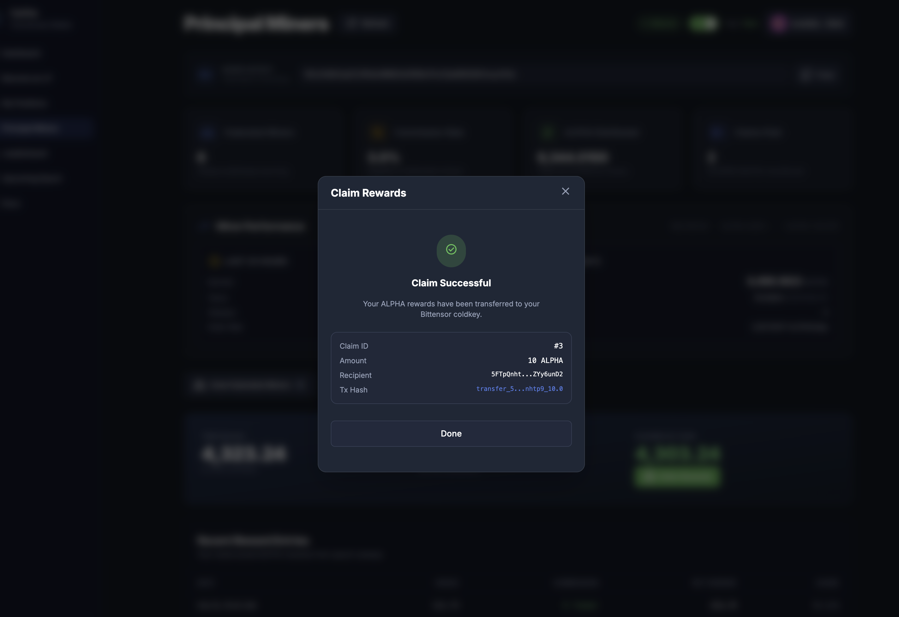

# Federated Miner Guide

Complete guide for becoming a federated miner on Cartha — no CLI required, everything is done through the web interface.

- **Web Interface**: [https://cartha.finance](https://cartha.finance)

## Overview

Federated miners provide liquidity by depositing USDC into a **principal miner's vault**. You do not need to register on the Bittensor subnet or run any CLI tools. All you need is an EVM wallet, USDC on Base, and a principal miner to lock through.

**What you'll do:**

1. Set up an EVM wallet on Base with ETH and USDC
2. Connect to Cartha and lock funds via "Become an LP"
3. Monitor your position and the principal miner's performance
4. Claim ALPHA rewards to a Bittensor coldkey

## Prerequisites

Before you begin, ensure you have:

- ✅ **EVM wallet** installed (MetaMask, Coinbase Wallet, Rabby, etc.)
- ✅ **Base Mainnet** network added to your wallet
- ✅ **Base ETH** in your wallet (for gas fees)
- ✅ **Base USDC** in your wallet (for liquidity provision)

> You do **not** need a Bittensor wallet, Python, or any CLI tools to lock funds. You will only need a Bittensor coldkey later when claiming ALPHA rewards.

---

## Step 1: Set Up Your Wallet

### Add Base Mainnet to Your Wallet

If Base isn't already in your wallet, add it manually:

```
Network Name: Base
RPC URL: https://mainnet.base.org
Chain ID: 8453
Currency Symbol: ETH
Block Explorer URL: https://basescan.org
```

**Quick Add:** Visit [Chainlist](https://chainlist.org/), search for "Base", and click "Add to MetaMask".

### Get ETH (for gas fees)

You'll need a small amount of ETH on Base for transaction gas. You can:
- Bridge ETH from Ethereum mainnet using the [Base Bridge](https://bridge.base.org/)
- Transfer from a centralized exchange that supports Base withdrawals (Coinbase, Binance, etc.)

### Get USDC (for liquidity)

You'll need USDC on Base for your deposit. You can:
- Bridge USDC from Ethereum mainnet using the [Base Bridge](https://bridge.base.org/)
- Transfer from a centralized exchange that supports Base USDC withdrawals

---

## Step 2: Lock Funds via "Become an LP"

### Connect Your Wallet

1. Go to [https://cartha.finance](https://cartha.finance)
2. Click **"Connect Wallet"** in the top right corner and select your wallet provider
3. Make sure you're connected to **Base Mainnet** network

### Navigate to "Become an LP"

4. Click **"Become an LP"** in the left navigation bar

### Enter Your Lock Details

5. **Enter the Principal Miner's Hotkey** — This is the SS58 address of the principal miner you want to lock through (a 48-character string starting with `5`). You can find principal miners on the [Principal Miners page](https://cartha.finance/principal-miners), the [Leaderboard](https://cartha.finance/leaderboard), or through community channels.


The system will verify the hotkey is registered on the subnet.

6. **Select a Pool** — Choose which trading pair you want to provide liquidity for (BTC/USD, ETH/USD, etc.)


7. **Enter Amount** — Specify how much USDC you want to lock (minimum 100,000 USDC)


8. **Set Lock Duration** — Choose how many days to lock your funds (minimum 7 days, maximum 365 days). Longer lock periods increase your deposit score and share of ALPHA rewards.


### Execute the Transaction

9. **Request Signature & Continue** — Click the button to proceed


10. **Approve USDC** — First, approve the vault contract to spend your USDC. Confirm in your wallet (requires a small gas fee in ETH).


11. **Lock Position** — After approval, confirm the second transaction to lock your USDC in the vault.


### Verify Your Position

12. **Wait for confirmation** — It may take 30 seconds to 5 minutes for the position to be processed by the verifier.


13. **View your position** — Navigate to **"My Positions"** in the sidebar to see your active lock.


You'll see:
- Pool ID and trading pair
- Principal miner hotkey
- Lock status
- Initially locked amount and total committed
- Lock expiration date
- Options to **Extend** or **Top Up** your position

---

## Step 3: Principal Miner Dashboard

Once your funds are locked, you can monitor your principal miner's performance and your own rewards from the **Principal Miners** page.

### Accessing the Dashboard

1. Click **"Principal Miners"** in the left navigation bar
2. The dashboard shows the General Tensor principal miner you're federated under



### Dashboard Overview

The top cards give you a quick summary:

| Card | What It Shows |
|------|---------------|
| **Federated Miners** | How many unique addresses are currently earning under this principal miner |
| **Commission Rate** | The percentage the principal miner takes from federated miner rewards (e.g., 3.0%) |
| **ALPHA Distributed** | Total net ALPHA distributed to all miners under this hotkey to date |
| **Claims Paid** | Number of ALPHA claim transactions that have been completed |

### Miner Performance

The **Miner Performance** section shows earnings over two time windows:

- **Last 24 Hours** — ALPHA earned, estimated TAO/USD value, number of sweeps, and daily rate (ALPHA/day)
- **Last 7 Days** — Same metrics over a weekly window

This helps you track how actively the principal miner is earning and whether performance is consistent.

### Your Earnings Summary

Below the performance section, you'll see your personal earnings:

- **Total Earned** — All ALPHA you've accumulated (all time)
- **Total Claimed** — ALPHA you've already withdrawn
- **Available to Claim** — ALPHA ready to be claimed right now

The green **"Claim Rewards"** button lets you withdraw your available ALPHA.

### Recent Reward Entries

A table showing your most recent ALPHA rewards from epoch sweeps:

| Column | Description |
|--------|-------------|
| **Date** | When the reward was swept |
| **Gross** | Total ALPHA amount before commission |
| **Commission** | Commission taken (shows "0 (home)" for the principal miner's own position) |
| **Net Reward** | ALPHA you actually receive |
| **Share** | Your percentage share of the total pool rewards |

### Claim History

A record of all your past reward claims showing date, amount, Bittensor coldkey used, status (Completed/Pending), and transaction hash.

### Federated Miner List

Click **"View Federated Miners"** to expand the list of all addresses earning under this principal miner.



Each entry shows:

| Column | Description |
|--------|-------------|
| **Miner** | Position identifier (Miner #1, #2, etc.) with a "You" badge on your own position |
| **Type** | **Home** (principal miner's own position) or **Guest** (federated miner) |
| **Share** | Your percentage share of the pool |
| **Total Earned** | ALPHA earned by this position |
| **Claimed** | ALPHA already claimed |
| **Available** | ALPHA available to claim |

---

## Step 4: Claim ALPHA Rewards

To claim your ALPHA rewards, you need a **Bittensor coldkey** (SS58 address) — this is where the ALPHA tokens will be sent on the Bittensor network.

### Get a Bittensor Wallet

If you don't already have a Bittensor wallet, you can create one using either method:

**Option 1: Talisman Browser Extension (Recommended for non-technical users)**

[Talisman](https://www.talisman.xyz/) is a browser extension wallet that supports Bittensor (Substrate) accounts.

1. Install the [Talisman extension](https://www.talisman.xyz/) for Chrome, Firefox, or Edge
2. Create a new wallet and **save your recovery phrase securely**
3. Add a Bittensor account (Substrate-based)
4. Copy your **coldkey SS58 address** (starts with `5`)

**Option 2: Bittensor CLI (btcli)**

If you prefer the command line:

```bash
pip install bittensor-cli
btcli wallet create
```

This creates both a coldkey and hotkey. Save your mnemonic phrase — you cannot recover your wallet without it.

For more details, see the [Bittensor CLI documentation](https://docs.learnbittensor.org/btcli).

### Claiming Your Rewards

1. Navigate to the **"Principal Miners"** page
2. Scroll down to your earnings summary and click the green **"Claim Rewards"** button


3. The **Claim Rewards** modal will appear showing your available ALPHA balance



4. **Enter the amount** of ALPHA you want to claim (or click **MAX** for the full available balance)

5. **Paste your Bittensor coldkey** (SS58 address) — this is where the ALPHA will be transferred on the Bittensor network



6. Click **"Sign & Claim"** — you'll be prompted to sign a message with your connected EVM wallet to verify ownership

7. Once the signature is confirmed, you'll see a **"Claim Successful"** confirmation showing the Claim ID, amount, recipient coldkey, and transaction hash.



8. Click **"Done"** to close the modal. You can track all your claims in the **Claim History** section on the dashboard.

---

## Managing Your Position

### Top Up (Add More USDC)

1. Go to **"My Positions"**
2. Click **"Top Up"** on your position
3. Enter the additional USDC amount
4. Confirm the transaction

### Extend Lock Duration

1. Go to **"My Positions"**
2. Click **"Extend"** on your position
3. Choose a new (longer) lock duration
4. Confirm the transaction

Extending your lock increases your deposit score, which means a larger share of ALPHA emissions.

### Withdraw After Expiry

Once your lock period and cooldown have both passed, your position will show as **Expired** with a **"Ready to withdraw"** status.

1. Go to **"My Positions"**
2. Your expired position will display the status, withdrawable amount, and a **"Withdraw"** button


3. Click **"Withdraw"** — a confirmation modal will appear showing:
   - Pool and lock duration
   - Expiration date and status
   - Total committed and the amount you will receive
   - Cooldown status (must show **Ready**)
   - Position owner and connected wallet match verification


4. Click **"Confirm Full Withdrawal"** and approve the transaction in your wallet
5. Your USDC will be returned to your connected EVM wallet

**Note:** There is a mandatory 7-day cooldown from the initial lock start. You can only withdraw after both the lock period and cooldown have passed. See [Fees & Rewards](../how-it-works/fees-and-rewards.md) for details.

### Multiple Positions

- ✅ Same hotkey + Same pool + **Different EVM wallet** → Creates a separate position
- ❌ Same hotkey + Same pool + **Same EVM wallet** → Use "Top Up" instead

---

## Important Notes

### Rewards & Weekly Epochs

- **ALPHA emissions**: Based on your deposit score (time × amount × pool weight)
- **Trading fees**: 50% of trading fees go to LPs, proportional to locked USDC
- Cartha operates on a **weekly epoch cycle**: Friday 00:00 UTC → Thursday 23:59 UTC
- **Best Practice**: Lock by **Thursday 23:00 UTC** to ensure inclusion in the next epoch
- The indexer needs up to 15 minutes to detect your position — give yourself buffer time
- Positions locked after Friday 00:00 UTC go into the *following* week's epoch

> 📘 **Learn more**: See [Weekly Epochs](../how-it-works/weekly-epochs.md) for a complete guide on epoch timing and how rewards are calculated.

### Transaction Requirements

- ✅ Must be connected to **Base Mainnet** network
- ✅ Need ETH for gas fees
- ✅ Need USDC in your wallet
- ✅ Two transactions required for locking: Approve + Lock

---

## Available Pools

| Pool Name | Vault Token | Address |
|-----------|-------------|---------|
| BTC/USD | cvBTC | [`0xD090239EaE0d756726b6afd57E0b23A24FCABe86`](https://basescan.org/address/0xD090239EaE0d756726b6afd57E0b23A24FCABe86) |
| ETH/USD | cvETH | [`0x47EbDBE398733664250356F7F19fd516a5f1Dd0a`](https://basescan.org/address/0x47EbDBE398733664250356F7F19fd516a5f1Dd0a) |
| GOLD/USD | cvGOLD | [`0xabc777A16E41CF6E2F02A768D1f9f4d8aa68e58F`](https://basescan.org/address/0xabc777A16E41CF6E2F02A768D1f9f4d8aa68e58F) |
| EUR/USD | cvEUR | [`0x8AE6DDb449b3D8d1fE961483Fbe1329b5e4cbD86`](https://basescan.org/address/0x8AE6DDb449b3D8d1fE961483Fbe1329b5e4cbD86) |
| GBP/USD | cvGBP | [`0x9Eed917485e08FdFee977629bf933E8C0B33e539`](https://basescan.org/address/0x9Eed917485e08FdFee977629bf933E8C0B33e539) |
| JPY/USD | cvJPY | [`0xf2e3f581A7dE8B055c0122E3bFb445A67b485831`](https://basescan.org/address/0xf2e3f581A7dE8B055c0122E3bFb445A67b485831) |

**Network**: Base Mainnet (Chain ID: 8453)

---

## Troubleshooting

### "Transaction failed" in wallet

- **Check Network**: Make sure you're on **Base Mainnet** (Chain ID: 8453)
- **Check Gas**: Ensure you have enough ETH for gas fees
- **Check USDC Balance**: Ensure you have enough USDC
- **Check Approval**: Make sure the approval transaction completed before locking
- **Wait and Retry**: Network congestion may cause delays

### Position not showing after locking

- Wait 30 seconds to 5 minutes for the verifier to process your lock
- Click the **Refresh** button on the "My Positions" page
- If it still doesn't appear after 5 minutes, check the transaction on [BaseScan](https://basescan.org/)

### "Position already exists"

- Use the **Top Up** button on "My Positions" to add more USDC to your existing position
- Use the **Extend** button to increase lock duration
- Or use a different EVM wallet to create a separate position

### Claim not processing

- Ensure you entered a valid Bittensor coldkey (SS58 address starting with `5`)
- Check that the EVM signature was completed successfully
- Track claim status in the **Claim History** section on the Principal Miners dashboard

---

## Quick Start Checklist

- [ ] EVM wallet installed (MetaMask, Coinbase Wallet, etc.)
- [ ] Base Mainnet network added
- [ ] ETH on Base (for gas fees)
- [ ] USDC on Base (for liquidity)
- [ ] Found a principal miner to lock through (browse [Principal Miners](https://cartha.finance/principal-miners) or [Leaderboard](https://cartha.finance/leaderboard))
- [ ] Locked funds via [Become an LP](https://cartha.finance)
- [ ] Position confirmed on [My Positions](https://cartha.finance/positions)
- [ ] Bittensor coldkey ready (for claiming ALPHA rewards)

---

## Resources

- **[Federated Miners (Participants)](../participants/federated-miners.md)** — Understanding the federated miner role, risks, and economics
- **[Weekly Epochs](../how-it-works/weekly-epochs.md)** — How epoch timing and rewards work
- **[Fees & Rewards](../how-it-works/fees-and-rewards.md)** — Full breakdown of fee and emission distribution
- **[FAQ](../faq.md)** — Common questions

### Support

- **Discord**: https://discord.gg/zGkW2kTsGM
- **Website**: https://cartha.finance
- **Email**: support@0xmarkets.io

---

**Ready to get started?** Visit [https://cartha.finance](https://cartha.finance) and start earning as a federated miner today!
