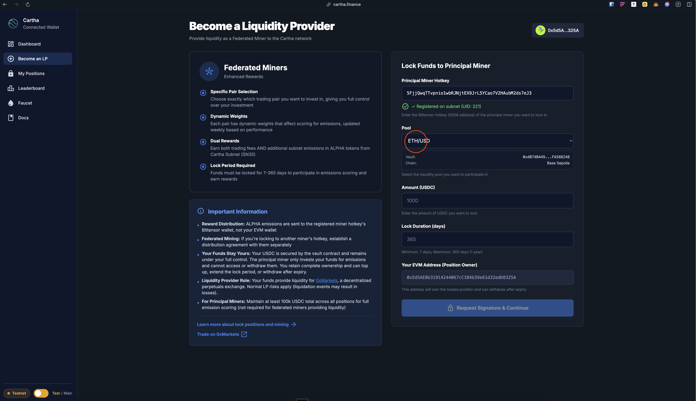
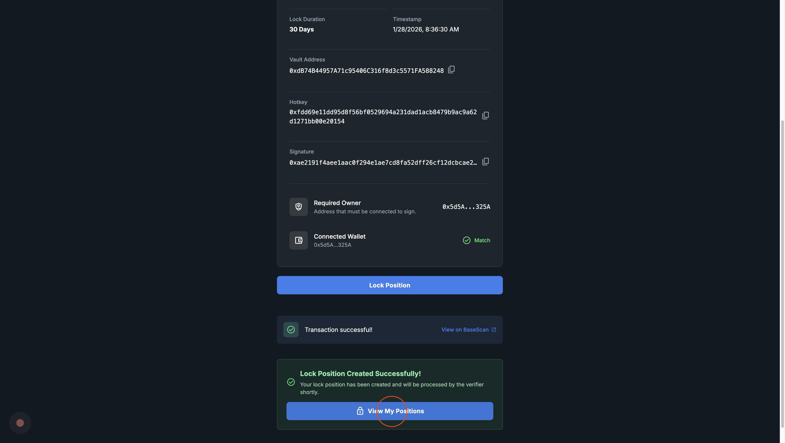
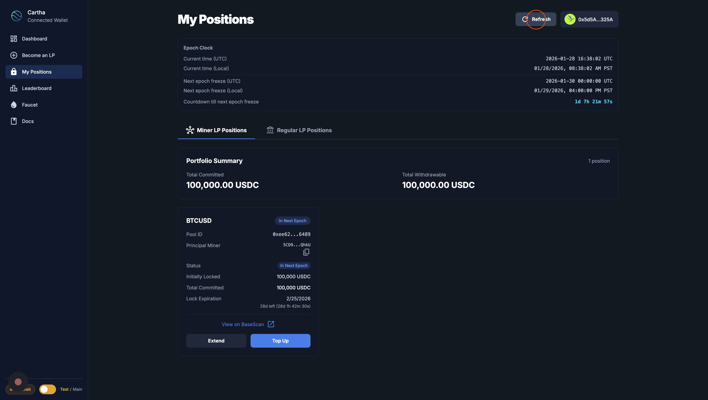
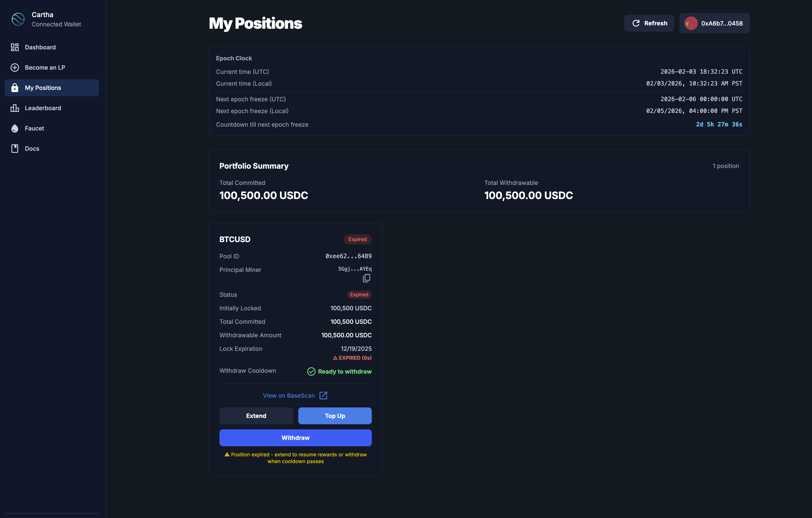

# Miner Guide

Complete guide for becoming a liquidity provider (miner) on Cartha using the web interface.

- **Web Interface**: [https://cartha.finance](https://cartha.finance)
- **CLI Repository**: [cartha-cli](https://github.com/General-Tao-Ventures/cartha-cli)
- **PyPI Package**: [cartha-cli](https://pypi.org/project/cartha-cli/)

## Overview

### For Principal Miners

Becoming a principal miner on Cartha involves three main steps:

1. **Create a Bittensor wallet** (coldkey + hotkey)
2. **Register your hotkey** to the Bittensor subnet (requires CLI)
3. **Lock USDC funds** to provide liquidity (done via web interface)

### For Federated Miners

Federated miners deposit to a principal miner and **do not need to register to the subnet**. You only need:

1. **EVM wallet** (MetaMask) with Base ETH for gas
2. **Base USDC** to deposit to a principal miner's vault

Skip to [Step 4: Lock Funds](#step-4-lock-funds-via-web-interface) to deposit as a federated miner.

## Prerequisites

Before you begin, ensure you have:

- ✅ Bittensor wallet set up (coldkey + hotkey) (If you are a principal miner)
- ✅ Python 3.11 installed (for CLI registration only)
- ✅ TAO in your Bittensor wallet (for registration)


- ✅ MetaMask (or other EVM wallet) installed
- ✅ Base Mainnet network added to MetaMask
- ✅ base ETH in your wallet (for gas fees)
- ✅ base USDC in your wallet (for liquidity provision)

## Step 1: Setup Your Wallet

### Add Base Mainnet Network to MetaMask

1. Open MetaMask and click the network dropdown
2. Click "Add Network" or "Add a network manually"
3. Enter the following details:

   ```
   Network Name: Base
   RPC URL: https://mainnet.base.org
   Chain ID: 8453
   Currency Symbol: ETH
   Block Explorer URL: https://basescan.org
   ```

4. Click "Save" and switch to Base network

**Quick Add (MetaMask):**

You can also use the [Chainlist](https://chainlist.org/) website:
1. Visit https://chainlist.org/
2. Search for "Base"
3. Click "Connect Wallet" and approve the connection
4. Click "Add to MetaMask" and confirm

### Get ETH (for gas fees)

You'll need ETH on Base Mainnet for transaction gas fees. You can:
- Bridge ETH from Ethereum mainnet using the [Base Bridge](https://bridge.base.org/)
- Transfer from a centralized exchange that supports Base withdrawals

### Get USDC (for liquidity)

You'll need USDC on Base Mainnet for liquidity provision. You can:
- Bridge USDC from Ethereum mainnet using the [Base Bridge](https://bridge.base.org/)
- Transfer from a centralized exchange that supports Base withdrawals

## Step 2: Create Bittensor Wallet

Before registering to the subnet, you need a Bittensor wallet (coldkey + hotkey). If you don't have one, create it using btcli:

```bash
btcli wallet create
```

This will create both a coldkey and hotkey. Make sure to:
- **Save your mnemonic phrase** securely - you cannot recover your wallet without it
- **Fund your wallet with TAO** - required for subnet registration

For more details on wallet management, see the [Bittensor CLI documentation](https://docs.learnbittensor.org/btcli).

## Step 3: Register to Subnet (Principal Miners Only)

**Note for Federated Miners**: If you're a federated miner depositing to a principal miner, skip this step and go directly to [Step 4: Lock Funds](#step-4-lock-funds-via-web-interface). You don't need to register to the subnet - just prepare your EVM wallet with Base ETH (for gas) and Base USDC (for deposit).

To participate as a principal miner, you need to register your Bittensor hotkey to the Cartha subnet (SN35).

### Option 1: Register via Cartha CLI (Recommended)

```bash
pip install cartha-cli
```

**Interactive mode:**

```bash
cartha miner register
```

The CLI will prompt you for your wallet names.

**Or with all arguments:**

```bash
cartha miner register --wallet-name <coldkey> --wallet-hotkey <hotkey>
```

### Option 2: Register via btcli

You can also register directly using btcli:

```bash
btcli subnets register --netuid 35
```

For more btcli options, see the [Bittensor CLI documentation](https://docs.learnbittensor.org/btcli).

### Registration Result

This will:
- Register your hotkey to subnet 35 (mainnet)
- Fetch your slot UID
- Display your registration details

**Important**: Save the output, especially your hotkey SS58 address - you'll need it for locking funds via the web interface.

## For Federated Miners

Federated miners deposit USDC to a principal miner's vault rather than registering their own hotkey. Here's what you need:

**Requirements:**
- ✅ EVM wallet (MetaMask or similar) connected to Base Mainnet
- ✅ Base ETH for gas fees
- ✅ Base USDC for your deposit

**Important - Reward Distribution:**
- Rewards are **NOT automatically distributed** to federated miners
- All rewards go to the principal miner's wallet
- The principal miner is responsible for distributing rewards to their federated miners
- Ensure you have a clear agreement with your principal miner regarding reward distribution terms

To deposit as a federated miner, proceed to [Step 4: Lock Funds](#step-4-lock-funds-via-web-interface) and use the principal miner's hotkey address.

## Step 4: Lock Funds via Web Interface

Now that your hotkey is registered, you can lock USDC funds to provide liquidity using the Cartha web interface.

### Navigate to "Become an LP"

1. Go to [https://cartha.finance](https://cartha.finance)
2. Click on "Become an LP" in the navigation bar
3. You'll see the **Federated Miners** option with a lock flow form on the right

### Enter Your Miner Details

**Note:** Make sure your wallet is connected to Base Mainnet network.

4. **Enter your Principal Miner Hotkey** - This is the SS58 address from your registration in Step 2


The system will verify your hotkey is registered on the subnet.

5. **Select a Pool** - Choose which trading pair you want to provide liquidity for (BTC/USD, ETH/USD, etc.)



6. **Enter Amount** - Specify how much USDC you want to lock


7. **Set Lock Duration** - Choose how many days to lock your funds (minimum 7 days, maximum 365 days)


### Execute Transaction

8. **Request Signature & Continue** - Click the button to proceed


9. **Approve USDC** - First, you need to approve the vault contract to spend your USDC


Approve the transaction in your wallet (this requires gas fees in ETH).

10. **Lock Position** - After approval, the second transaction will lock your USDC in the vault



Confirm the lock transaction in your wallet.

### Verify Your Position

11. **Wait for confirmation** - It may take 30 seconds to 5 minutes for the position to be processed



12. **View your positions** - Navigate to "My Positions" to see your active locks


You'll see:
- Pool ID and trading pair
- Principal Miner hotkey
- Lock status
- Initially locked amount
- Total committed amount
- Lock expiration date
- Options to **Extend** or **Top Up** your position

### Important Notes

**Transaction Requirements:**
- ✅ Must be connected to **Base Mainnet** network
- ✅ Need ETH for gas fees
- ✅ Need USDC in your wallet
- ✅ Two transactions required: Approve + Lock

**Managing Positions:**
- Visit [My Positions](https://cartha.finance/positions) to view all your locks
- Use "Extend" to increase lock duration
- Use "Top Up" to add more USDC to existing position

**Multiple Positions:**
- ✅ Same hotkey + Same pool + **Different EVM wallet** → Creates separate position
- ❌ Same hotkey + Same pool + **Same EVM wallet** → Use "Top Up" instead

**Rewards & Weekly Epochs:**
- **ALPHA emissions** based on your deposit score (time × amount locked)
- **50% of trading fees** generated by the 0xMarkets protocol
- Cartha operates on a **weekly epoch cycle**: Friday 00:00 UTC → Thursday 23:59 UTC
- **Best Practice**: Lock by **Thursday 23:00 UTC** to ensure inclusion in the next epoch
- The indexer needs up to 15 minutes to detect your position on Base chain — give yourself buffer time!
- Positions locked after Friday 00:00 UTC go into the *following* week's epoch
- Longer lock periods increase your deposit score and rewards

> 📘 **Learn more**: See [Weekly Epochs](../how-it-works/weekly-epochs.md) for a complete guide on epoch timing, how rewards are calculated, and timezone references.

## Step 5: Set Up Automated Rewards (Optional — for Public Mode)

If you plan to accept federated miners (external capital), deploy the **Principal Miner Template** to automate reward distribution:

1. **Clone the template:**
   ```bash
   git clone https://github.com/General-Tao-Ventures/cartha-principal-miner-template.git
   cd cartha-principal-miner-template
   ```

2. **Configure and deploy** — see the [template README](https://github.com/General-Tao-Ventures/cartha-principal-miner-template#readme) for Docker and bare-metal setup guides

3. **Apply to be listed** — visit [cartha.finance/principal-miners/apply](https://cartha.finance/principal-miners/apply) to submit your application. Once approved, your miner will appear on the [Principal Miners](https://cartha.finance/principal-miners) page for federated miners to discover.

> This step is optional if you're mining solo (private mode). The rewards system is only needed if you want to accept and distribute rewards to federated miners.

## Step 6: Check Your Miner Status (Optional)

You can verify your miner status using the CLI or by viewing "My Positions" on the web interface.

### Via Web Interface (Recommended)

Simply visit [https://cartha.finance/positions](https://cartha.finance/positions) to see all your active positions.

### Via CLI

```bash
# Interactive mode
cartha miner status

# Or with arguments
cartha miner status --wallet-name <coldkey> --wallet-hotkey <hotkey>
```

This shows:
- Miner state and pool information
- All active pools with amounts and expiration dates
- Days remaining countdown
- Registration status

## Step 7: Withdraw After Expiry

Once your lock period and the mandatory 7-day cooldown have both passed, you can withdraw your USDC.

### Expired Position

When your position expires, it will show as **Expired** on the "My Positions" page with the withdrawable amount and a **"Ready to withdraw"** cooldown status.



### Confirm Withdrawal

1. Click **"Withdraw"** on your expired position
2. A confirmation modal will appear showing:
   - Pool and lock duration
   - Expiration date and status
   - Total committed and the amount you will receive
   - Cooldown status (must show **Ready**)
   - Position owner and connected wallet match verification


3. Click **"Confirm Full Withdrawal"** and approve the transaction in your wallet
4. Your USDC will be returned to your connected EVM wallet

**Note:** The 7-day cooldown starts from lock creation, not from lock expiry. You can only withdraw after both the lock period and cooldown have passed. See [Fees & Rewards](../how-it-works/fees-and-rewards.md) for details.

## Available Pools

| Pool Name | Vault Token | Address |
|-----------|-------------|---------|
| BTC/USD | cvBTC | [`0xD090239EaE0d756726b6afd57E0b23A24FCABe86`](https://basescan.org/address/0xD090239EaE0d756726b6afd57E0b23A24FCABe86) |
| ETH/USD | cvETH | [`0x47EbDBE398733664250356F7F19fd516a5f1Dd0a`](https://basescan.org/address/0x47EbDBE398733664250356F7F19fd516a5f1Dd0a) |
| GOLD/USD | cvGOLD | [`0xabc777A16E41CF6E2F02A768D1f9f4d8aa68e58F`](https://basescan.org/address/0xabc777A16E41CF6E2F02A768D1f9f4d8aa68e58F) |
| EUR/USD | cvEUR | [`0x8AE6DDb449b3D8d1fE961483Fbe1329b5e4cbD86`](https://basescan.org/address/0x8AE6DDb449b3D8d1fE961483Fbe1329b5e4cbD86) |
| GBP/USD | cvGBP | [`0x9Eed917485e08FdFee977629bf933E8C0B33e539`](https://basescan.org/address/0x9Eed917485e08FdFee977629bf933E8C0B33e539) |
| JPY/USD | cvJPY | [`0xf2e3f581A7dE8B055c0122E3bFb445A67b485831`](https://basescan.org/address/0xf2e3f581A7dE8B055c0122E3bFb445A67b485831) |

**Network**: Base Mainnet (Chain ID: 8453)

You can select any of these pools when locking funds via the web interface. The pool selection is handled automatically in the UI.

## Common CLI Commands (Reference)

```bash
# Register to subnet (required once)
cartha miner register --wallet-name <coldkey> --wallet-hotkey <hotkey>

# Check miner status
cartha miner status --wallet-name <coldkey> --wallet-hotkey <hotkey>

# View help
cartha --help
cartha miner --help
```

**Note**: Locking funds is now done via the web interface at [https://cartha.finance](https://cartha.finance), not through CLI.

## Troubleshooting

### "Hotkey not registered" or "Invalid hotkey"

**Problem**: Hotkey is not registered on the subnet

**Solution**:

- Register your hotkey first using `cartha miner register`
- Verify you're using the correct network (`finney`) and netuid (`35`)
- Check that you have TAO in your Bittensor wallet
- Make sure you're entering the correct SS58 address in the web interface

### "Transaction failed" in MetaMask

**Problem**: Approval or lock transaction failed

**Solution**:

- **Check Network**: Make sure you're on **Base Mainnet** network (Chain ID: 8453)
- **Check Gas**: Ensure you have enough ETH for gas fees
- **Check USDC Balance**: Ensure you have enough USDC in your wallet
- **Check Approval**: Make sure the first approval transaction completed successfully
- **Wait and Retry**: Network congestion may cause delays - wait a bit and retry

### "Insufficient funds" or "Not enough ETH"

**Problem**: Don't have enough ETH for gas

**Solution**:

- Bridge ETH from Ethereum mainnet using the [Base Bridge](https://bridge.base.org/)
- Transfer from a centralized exchange that supports Base withdrawals
- Wait for the transaction to complete
- Retry your transaction

### "USDC balance is zero" or "No USDC found"

**Problem**: Don't have USDC tokens

**Solution**:

- Bridge USDC from Ethereum mainnet using the [Base Bridge](https://bridge.base.org/)
- Transfer from a centralized exchange that supports Base withdrawals
- Verify receipt on [BaseScan](https://basescan.org/)

### "Position already exists"

**Problem**: You're trying to create a duplicate position with the same hotkey, pool, and wallet

**Solution**:

- Use the **Top Up** button on the "My Positions" page to add more USDC to your existing position
- Use the **Extend** button to increase the lock duration
- Or use a different EVM wallet address to create a separate position

### "Wallet not connected" or "Wrong network"

**Problem**: Your wallet is not connected or on the wrong network

**Solution**:

1. Click "Connect Wallet" in the top right corner
2. Select your wallet provider (MetaMask, Coinbase Wallet, WalletConnect, etc.)
3. Make sure you're connected to **Base Mainnet** network
4. If you're on the wrong network, switch to Base in your wallet

### Position not showing after locking

**Problem**: Lock transaction succeeded but position doesn't appear

**Solution**:

- Wait 30 seconds to 5 minutes for the verifier to process your lock
- Click the **Refresh** button on "My Positions" page
- The verifier automatically detects your lock and adds you to the upcoming epoch
- If it still doesn't appear after 5 minutes, check the transaction on [BaseScan](https://basescan.org/)

## Quick Start Checklist

### Before You Begin

- [ ] Bittensor wallet created (coldkey + hotkey)
- [ ] Python 3.11 installed
- [ ] Cartha CLI installed (`pip install cartha-cli`)
- [ ] MetaMask (or other EVM wallet) installed
- [ ] Base Mainnet network added to MetaMask
- [ ] ETH in your wallet (for gas fees)
- [ ] USDC in your wallet (for liquidity)
- [ ] TAO in your Bittensor wallet (for registration)

### Quick Setup Steps

1. **Get Tokens**
   - Bridge or transfer ETH to Base Mainnet
   - Bridge or transfer USDC to Base Mainnet
   - Ensure you have TAO for registration

2. **Register Your Hotkey**
   ```bash
   pip install cartha-cli
   cartha miner register --wallet-name <coldkey> --wallet-hotkey <hotkey>
   ```
   Save your hotkey SS58 address!

3. **Lock Funds via Web Interface**
   - Go to https://cartha.finance
   - Click "Become an LP"
   - Enter your hotkey SS58 address
   - Choose pool, amount, and lock duration
   - Connect wallet (Base Mainnet network)
   - Approve USDC transaction
   - Confirm lock transaction

4. **Verify Your Position**
   - Visit https://cartha.finance/positions
   - Your position should appear within 30 seconds to 5 minutes


---

**Ready to become a miner?** Visit [https://cartha.finance](https://cartha.finance) and start providing liquidity today!
