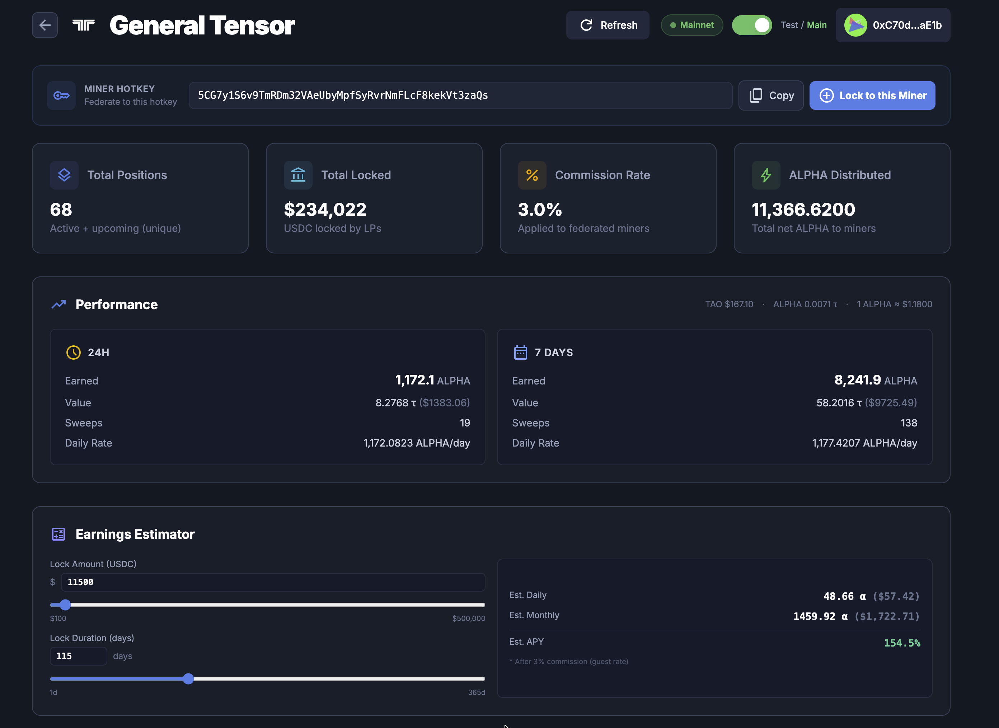
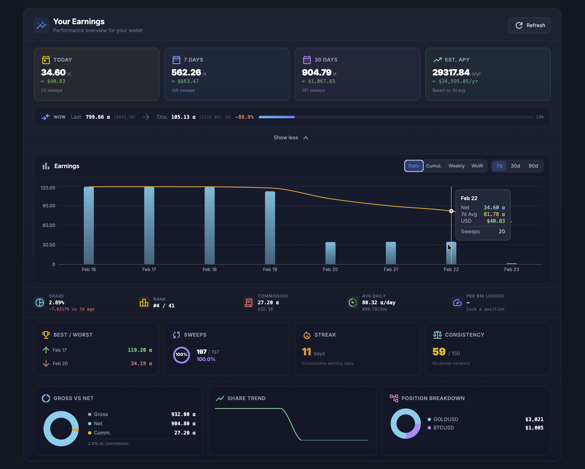
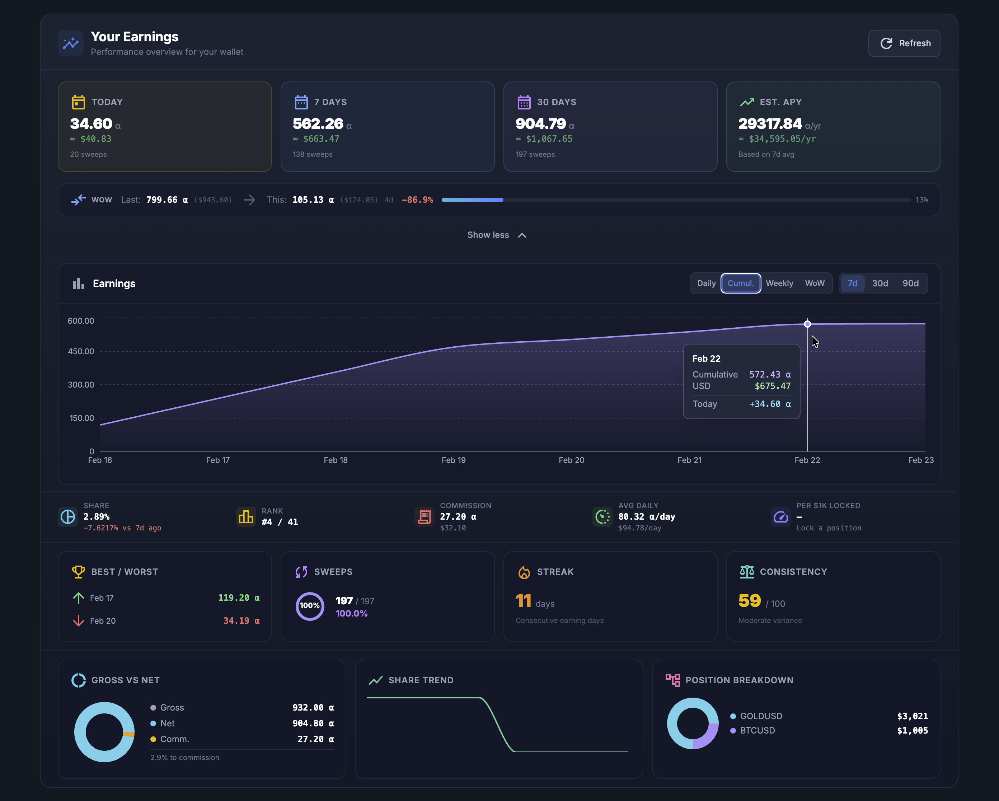
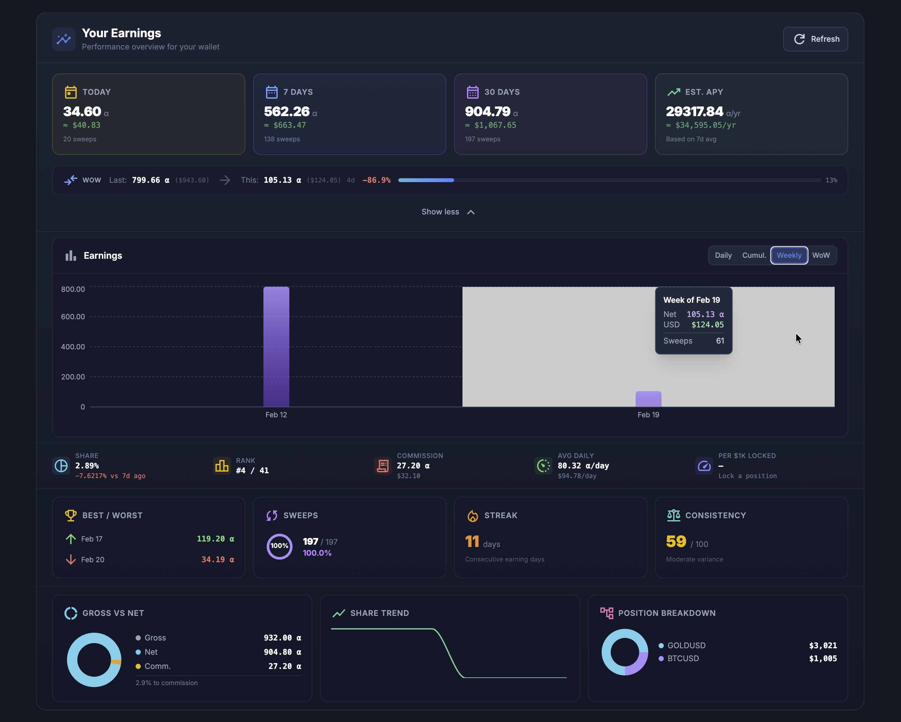
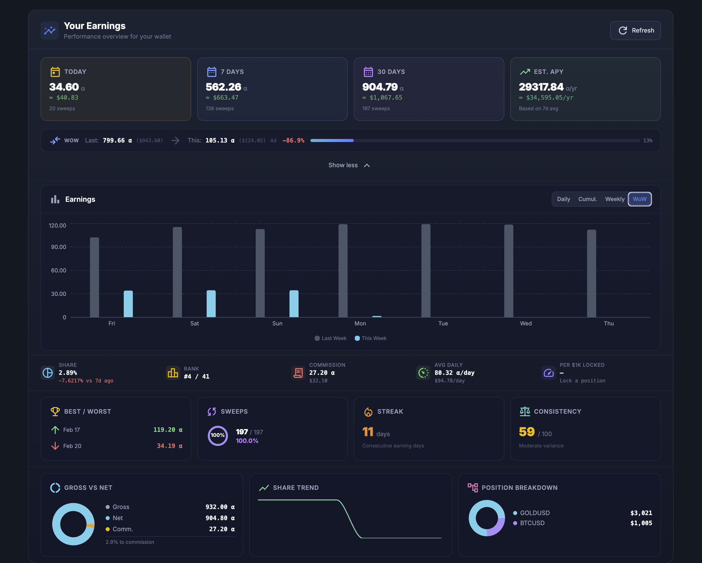
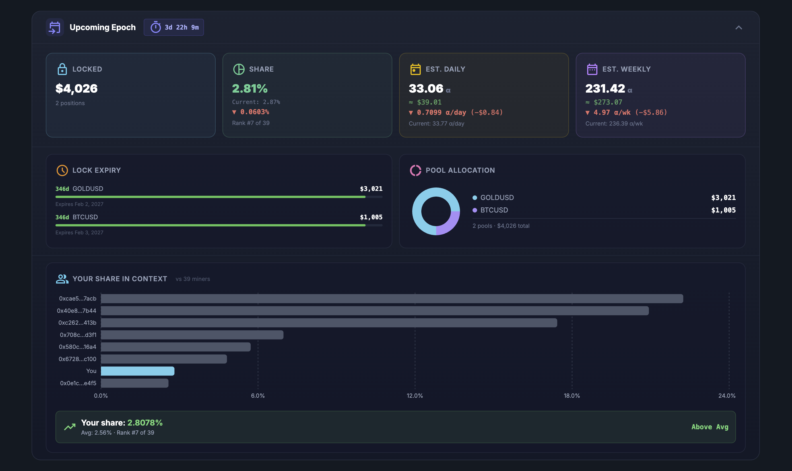
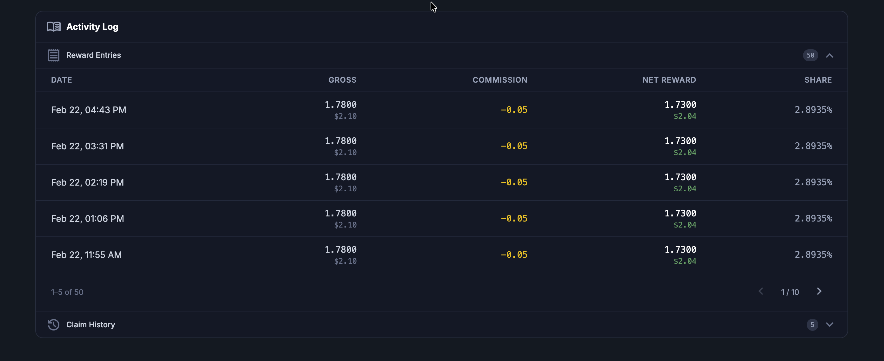

# Principal Miner Dashboard

Track your federated mining earnings, monitor your positions, and plan your next moves — all from the [Principal Miner Dashboard](https://cartha.finance/principal-miners).

> This guide walks through every section of the dashboard so you know exactly what each number means and how to use it.

---

## Getting There

1. Go to [cartha.finance/principal-miners](https://cartha.finance/principal-miners)
2. Pick a principal miner (e.g. **General Tensor**)
3. Connect your EVM wallet (top-right) to see your personal earnings

Without a wallet connected you can still see the public info (stats, performance, estimator). Connect your wallet to unlock your personal earnings dashboard, upcoming epoch details, and activity logs.

---

## Public Info (No Wallet Needed)

These sections are visible to everyone — useful for evaluating a principal miner before you lock.

### Miner Overview Cards

<figure><figcaption>Principal miner overview with stats cards, performance, and earnings estimator</figcaption></figure>

At the top of the dashboard you'll see four summary cards:

| Card | What It Means |
|------|---------------|
| **Total Positions** | How many federated miner positions are active + upcoming under this principal miner. More positions = more capital in the pool. |
| **Total Locked** | Total USDC locked by all federated miners in this principal miner's pool. |
| **Commission Rate** | The % the principal miner takes from your gross ALPHA rewards each sweep. For example, 3.0% means you keep 97% of your earnings. |
| **ALPHA Distributed** | Total net ALPHA that has been distributed to all federated miners since the beginning. |

### Miner Hotkey

The **Miner Hotkey** bar shows the principal miner's Bittensor SS58 address. You can:

- **Copy** it to use when locking via "Become an LP"
- **Lock to this Miner** button — opens the lock form directly

### Performance

The **Performance** section shows how much ALPHA this principal miner has been earning from the subnet:

- **24H** — ALPHA earned in the last 24 hours, its value in TAO and USD, number of sweeps, and the daily rate
- **7 DAYS** — Same metrics over a 7-day window

This tells you how productive the miner is. Higher daily rates mean more ALPHA flowing to federated miners.

The current **TAO price**, **ALPHA price**, and the conversion rate (e.g. `1 ALPHA ≈ $1.18`) are shown at the top-right of this section for reference.

### Earnings Estimator

The **Earnings Estimator** lets you model "what would I earn if I locked X USDC for Y days?" before committing any funds.

- **Lock Amount (USDC)** — Drag the slider or type a custom amount ($100 to $500K+)
- **Lock Duration (days)** — 1 to 365 days. Longer locks = higher boost = bigger share of emissions
- **Est. Daily** — Projected daily ALPHA earnings (and USD equivalent)
- **Est. Monthly** — Daily × 30
- **Est. APY** — Annualized percentage yield based on current pool conditions

> The estimator uses the same scoring formula as the [Earning Simulator](https://cartha.finance/upcoming) on the Upcoming Epoch page: `score = amount × min(lock_days, 365) / 365`. Longer locks earn proportionally more per dollar locked. All estimates are after commission.

---

## Your Miner Dashboard (Wallet Connected)

Connect your wallet to see your personal earnings. Everything below requires a connected wallet that has active positions with this principal miner.

### Your Earnings — Summary Cards

<figure><figcaption>Your Earnings overview showing summary cards, WoW comparison, and daily earnings chart</figcaption></figure>

Four cards at the top give you a quick snapshot:

| Card | What It Shows |
|------|---------------|
| **TODAY** | ALPHA earned so far today, USD value, and sweep count |
| **7 DAYS** | Total ALPHA earned in the last 7 days with USD value and sweep count |
| **30 DAYS** | Same for the last 30 days |
| **EST. APY** | Annualized yield based on your 7-day average daily earnings. Shows both ALPHA/yr and USD/yr |

### Week-over-Week (WoW) Bar

Right below the summary cards is a compact **WoW comparison bar** showing:

- **Last week's** total ALPHA and USD value
- **This week's** total so far (with day count)
- **% change** — green if up, red if down
- **Progress bar** — visual showing how this week compares to last

Cartha epochs run **Friday 00:00 UTC to Thursday 23:59 UTC**, so "this week" and "last week" follow that cycle.

### Earnings Charts

Click **"Show detailed analytics"** to expand the full chart section. Four chart modes are available:

#### Daily View

<figure><figcaption>Daily bar chart with 7-day moving average overlay</figcaption></figure>

- **Blue bars** = your net ALPHA earned each day
- **Orange line** = 7-day moving average (smooths out daily variance)
- Hover any bar to see: net ALPHA, 7d average, USD value, and sweep count
- Toggle between **7d**, **30d**, and **90d** time ranges

#### Cumulative View

<figure><figcaption>Cumulative ALPHA chart showing total earnings growth over time</figcaption></figure>

- Shows your total accumulated ALPHA over time
- Hover to see cumulative total, USD value, and that day's contribution
- Useful for seeing your overall growth trajectory

#### Weekly View

<figure><figcaption>Weekly bucket chart showing ALPHA earned per epoch</figcaption></figure>

- Each bar = one epoch week (Fri–Thu)
- Hover to see net ALPHA, USD value, and sweep count for that week
- Quick way to compare week-to-week performance

#### WoW Overlay

<figure><figcaption>This Week vs Last Week side-by-side comparison by day of week</figcaption></figure>

- **Grey bars** = last week's daily earnings
- **Cyan bars** = this week's daily earnings
- X-axis shows day of week (Fri through Thu)
- Instantly see which days you're earning more or less than last week

### Inline Metrics

Below the chart, five quick-glance metrics:

| Metric | What It Means |
|--------|---------------|
| **Share** | Your current share of this principal miner's pool, with change vs 7 days ago |
| **Rank** | Your rank among all federated miners in this pool (e.g. #4 / 41) |
| **Commission** | Total ALPHA paid in commission so far (and USD value) |
| **Avg Daily** | Your average daily ALPHA earnings based on 7-day window |
| **Per $1K Locked** | How much ALPHA you earn per day for every $1,000 locked. Useful for comparing efficiency across different lock amounts |

### Detailed Stats Cards

Four cards with deeper insights:

| Card | What It Shows |
|------|---------------|
| **Best / Worst** | Your highest-earning day and lowest-earning completed day (excludes today since it's still in progress) |
| **Sweeps** | How many sweeps you participated in vs total sweeps, with participation percentage |
| **Streak** | Consecutive days with earnings. If you're earning every day, this number grows |
| **Consistency** | Score from 0–100 measuring how stable your daily earnings are. 70+ = very stable, 40–70 = moderate variance, below 40 = high variance |

### Bottom Row

Three more visualizations:

| Section | What It Shows |
|---------|---------------|
| **Gross vs Net** | Donut chart showing your gross earnings, net earnings, and total commission paid. Shows the effective commission percentage |
| **Share Trend** | Sparkline chart of your pool share over time. Rising = you're gaining relative share; falling = others are growing faster |
| **Position Breakdown** | Donut chart showing how your locked USDC is allocated across different pools (e.g. GOLDUSD, BTCUSD) |

---

## Upcoming Epoch

<figure><figcaption>Upcoming Epoch panel showing projected earnings, lock expiry, pool allocation, and share context</figcaption></figure>

The **Upcoming Epoch** panel (click to expand) shows what your next epoch will look like. This is important because positions can change between epochs — locks expire, new ones are added — and your share shifts accordingly.

### Summary Cards

| Card | What It Means |
|------|---------------|
| **Locked** | Total USDC you have locked for the upcoming epoch, with position count. Shows delta vs your current active amount |
| **Share** | Your projected share of this principal miner's pool for next epoch, compared to your current share. Green ▲ = gaining share, Red ▼ = losing share |
| **Est. Daily** | Projected daily ALPHA earnings for the upcoming epoch based on your new share. Shows delta vs current daily rate |
| **Est. Weekly** | Projected weekly ALPHA (daily × 7) with delta vs current |

### Countdown

The countdown badge (e.g. `3d 22h 9m until freeze`) shows how much time until the next epoch locks in. Epochs freeze at **Friday 00:00 UTC** — after that, no position changes take effect until the following week.

### Lock Expiry

Shows each of your positions with:

- **Days remaining** until expiry (color-coded: green = plenty of time, amber = under 30 days, red = under 7 days)
- **Pool name** and **amount**
- **Expiry date**

Plan ahead — once a lock expires, it won't be included in the next epoch unless you re-lock.

### Pool Allocation

A donut chart showing how your upcoming USDC is split across pools (e.g. GOLDUSD $3,021 + BTCUSD $1,005).

### Your Share in Context

A horizontal bar chart comparing your share to other federated miners in this principal miner's pool:

- **Cyan bar** = you
- **Grey bars** = other miners
- **Callout** shows your exact share %, whether you're above or below average, and your rank

---

## Activity Log

<figure><figcaption>Reward Entries showing per-sweep earnings with gross, commission, net, and share</figcaption></figure>

<figure><figcaption>Claim History showing past reward claims with amounts, status, and transaction links</figcaption></figure>

The **Activity Log** at the bottom contains two collapsible sections:

### Reward Entries

Every time a sweep happens (multiple times per day), a reward entry is logged showing:

| Column | What It Means |
|--------|---------------|
| **Date** | When the sweep occurred |
| **Gross** | Total ALPHA before commission (with USD value) |
| **Commission** | ALPHA deducted by the principal miner |
| **Net Reward** | What you actually receive (with USD value) |
| **Share** | Your pool share at the time of that sweep |

Paginated — use the navigation at the bottom to browse older entries.

### Claim History

Shows all your past reward claims:

| Column | What It Means |
|--------|---------------|
| **Date** | When you submitted the claim |
| **Amount** | ALPHA claimed |
| **BT Coldkey** | The Bittensor coldkey you claimed to |
| **Status** | Completed, Pending, or Failed |
| **TX Hash** | Link to the transaction on the explorer |

---

## Tips for Degens

1. **Check the WoW bar daily** — If this week is tracking below last week, your share might be getting diluted by new depositors
2. **Watch your Share Trend** — A declining share means others are locking more capital or longer durations. Consider extending your lock or adding more USDC
3. **Use the Earnings Estimator** — Before locking, model different amounts and durations. The APY difference between a 30-day and 365-day lock is massive because of the scoring boost
4. **Monitor Upcoming Epoch** — If your lock is expiring and you don't re-lock, your share drops to zero next epoch
5. **Streak and Consistency scores** — High streak + high consistency = the miner is reliably distributing. Low consistency might just mean volatile trading days
6. **Compare Per $1K Locked** — This normalizes earnings across different position sizes so you can compare apples to apples
7. **Claim regularly** — Your ALPHA rewards accumulate but don't auto-compound. Claim them to your Bittensor coldkey when you're ready. See **[How to Claim Rewards](claim-rewards.md)** for a video walkthrough

---

## Ready to Start Earning?

Lock USDC through a principal miner and start earning ALPHA rewards today.

1. **[Browse Principal Miners](https://cartha.finance/principal-miners)** — Compare commission rates, locked capital, and performance
2. **[Try the Earnings Estimator](https://cartha.finance/principal-miners)** — Model your returns before you commit
3. **[Lock & Earn](https://cartha.finance/principal-miners)** — Pick a miner, hit "Lock to this Miner", choose your amount and duration, and you're in

No Bittensor setup, no CLI, no infra to run. Just USDC on Base and an EVM wallet.

> New here? Start with **[General Tensor](https://cartha.finance/principal-miners/general-tensor)** — the team-operated miner with 3% commission, automated distribution, and full dashboard transparency. Follow the **[Federated Miner Guide](federated-miner-guide.md)** for a step-by-step walkthrough.

---

## Related Guides

- **[How to Claim Rewards](claim-rewards.md)** — Video walkthrough for claiming ALPHA
- **[Federated Miner Guide](federated-miner-guide.md)** — How to set up, lock, and claim
- **[Deposit via Principal Miner](federated-miner-deposit-principal.md)** — Step-by-step locking walkthrough
- **[Weekly Epochs](../how-it-works/weekly-epochs.md)** — How the Friday-to-Thursday epoch cycle works
- **[Fees & Rewards](../how-it-works/fees-and-rewards.md)** — Full breakdown of how earnings are calculated
- **[Earning Simulator](https://cartha.finance/upcoming)** — Advanced simulator with full position ranking table
