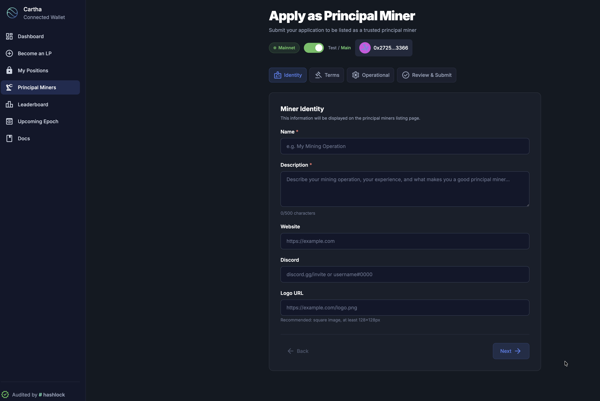
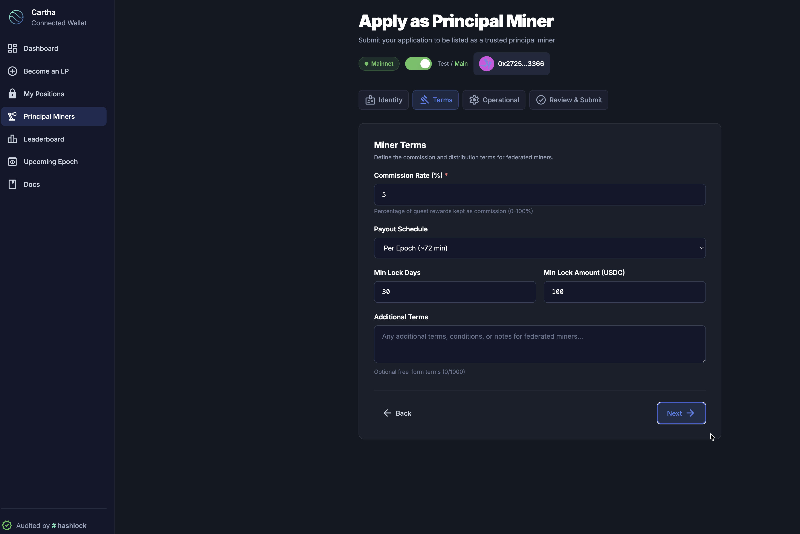
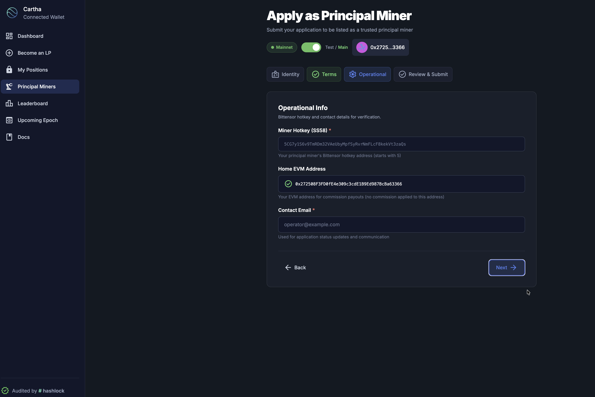

# Principal Miner Guide

Step-by-step guide to becoming a principal miner on Cartha — register your hotkey, lock capital, set up automated rewards, and get listed for federated miners to find you.

- **Web Interface**: [cartha.finance](https://cartha.finance)
- **CLI**: [cartha-cli on PyPI](https://pypi.org/project/cartha-cli/) · [GitHub](https://github.com/General-Tao-Ventures/cartha-cli)
- **Rewards Template**: [cartha-principal-miner-template](https://github.com/General-Tao-Ventures/cartha-principal-miner-template)

---

## Overview

A principal miner operates a registered Bittensor hotkey on Cartha subnet (SN35). You lock USDC to provide liquidity for [0xMarkets](https://0xmarkets.io) and earn ALPHA emissions based on your deposit score.

You can run in two modes:

| Mode | Description |
|------|-------------|
| **Private (Solo)** | Lock only your own capital, receive 100% of emissions |
| **Public (Investment Manager)** | Accept capital from federated miners, charge a commission, distribute rewards |

Most principal miners start private and go public once they're comfortable with operations.

### Important Requirements

- **Minimum 100,000 USDC portfolio** — Your total locked USDC across all positions (your own + all federated miners) must reach at least $100K before your miner starts receiving ALPHA emissions. Below this threshold, your hotkey is registered but earns nothing.
- **Always-on distribution node** — If you run in public mode, the automated rewards node (Step 4) must stay running 24/7. It monitors epochs, sweeps ALPHA, and processes claims for your federated miners. If the node goes down, reward distribution stops until it's back online.

---

## Prerequisites

Before you begin, make sure you have:

- ✅ **EVM wallet** (MetaMask or similar) on Base Mainnet with ETH and USDC — see the [Miner Guide](miner-guide.md) for wallet setup
- ✅ **Python 3.11+** installed (for CLI registration)
- ✅ **TAO** in a Bittensor wallet (for subnet registration)

---

## Step 1: Create a Bittensor Wallet

You need a Bittensor wallet (coldkey + hotkey) to register on the subnet.

```bash
btcli wallet create
```

This creates both a coldkey and hotkey. Important:

- **Save your mnemonic phrase** — you cannot recover your wallet without it
- **Fund your wallet with TAO** — required for subnet registration

See the [Bittensor CLI docs](https://docs.learnbittensor.org/btcli) for more on wallet management.

---

## Step 2: Register to the Subnet

Register your hotkey to Cartha subnet (SN35).

### Option A: Cartha CLI (Recommended)

```bash
pip install cartha-cli

# Interactive mode
cartha miner register

# Or with arguments
cartha miner register --wallet-name <coldkey> --wallet-hotkey <hotkey>
```

### Option B: btcli

```bash
btcli subnets register --netuid 35
```

After registration you'll see your hotkey SS58 address — **save it**, you'll need it for locking funds.

---

## Step 3: Lock Funds

Now lock USDC to provide liquidity via the web interface.

1. Go to [cartha.finance](https://cartha.finance) → **"Become an LP"**
2. **Enter your hotkey** (the SS58 address from Step 2)


3. **Select a pool** (BTC/USD, ETH/USD, GOLD/USD, etc.)


4. **Enter amount** and **set lock duration** (7–365 days)


5. **Execute the transaction** — two steps: Approve USDC, then Confirm Lock


6. **Verify** — your position should appear at [cartha.finance/positions](https://cartha.finance/positions) within 30 seconds to 5 minutes


> Lock by **Thursday 23:00 UTC** to be included in the next epoch. See [Weekly Epochs](../how-it-works/weekly-epochs.md) for timing details.

> **100K minimum**: Your miner won't start receiving ALPHA emissions until the total USDC locked under your hotkey (your own + all federated miners) reaches at least **$100,000**. Plan your initial capital and federated miner outreach accordingly.

---

## Step 4: Set Up Automated Rewards (Public Mode)

If you want to accept federated miners, deploy the rewards system so they can track earnings and claim ALPHA directly from your dashboard.

### Deploy the Template

```bash
git clone https://github.com/General-Tao-Ventures/cartha-principal-miner-template.git
cd cartha-principal-miner-template
cp .env.example .env
# Edit .env with your configuration
docker compose up -d
```

This starts a PostgreSQL database, API server (port 8100), and epoch monitor.

### Key Configuration

| Variable | Description |
|----------|-------------|
| `MINER_HOTKEY` | Your Bittensor hotkey (SS58) |
| `MINER_COLDKEY` | Your Bittensor coldkey (SS58) |
| `AGGREGATOR_HOTKEY` | Aggregator hotkey for reward accumulation |
| `WALLET_PASSWORD` | Password to unlock your BT wallet |
| `COMMISSION_RATE` | Your commission (e.g. `0.03` for 3%) |
| `MINER_NAME` | Display name on the listing page |
| `MINER_DESCRIPTION` | Description shown on the listing page |

See the [template README](https://github.com/General-Tao-Ventures/cartha-principal-miner-template#configuration) for the full configuration reference.

> This step is optional if you're mining solo (private mode). The rewards system is only needed to accept and distribute to federated miners.

> **Keep it running 24/7.** The distribution node must stay online at all times. It monitors the Bittensor chain for new epochs, sweeps accumulated ALPHA, scores positions, and processes federated miner claims. If the node goes down, your federated miners can't receive or claim rewards until it's back up. Use a reliable VPS or cloud provider with monitoring and auto-restart (e.g. Docker restart policies, systemd, or cloud health checks).

---

## Step 5: Apply to Get Listed

Once your rewards system is live, apply to be listed on the [Principal Miners](https://cartha.finance/principal-miners) page so federated miners can discover you.

Go to [cartha.finance/principal-miners/apply](https://cartha.finance/principal-miners/apply) and complete the 4-step application:

### 1. Identity

<figure><figcaption>Step 1: Set your miner name, description, website, Discord, and logo</figcaption></figure>

| Field | Required | Description |
|-------|----------|-------------|
| **Name** | Yes | Your miner's display name (e.g. "My Mining Operation") |
| **Description** | Yes | Describe your operation, experience, and what makes you a good principal miner (up to 500 characters) |
| **Website** | No | Your website URL |
| **Discord** | No | Discord invite link or username |
| **Logo URL** | No | Link to a square image (at least 128x128px) |

### 2. Terms

<figure><figcaption>Step 2: Define your commission rate, payout schedule, and minimum requirements</figcaption></figure>

| Field | Required | Description |
|-------|----------|-------------|
| **Commission Rate (%)** | Yes | Percentage of gross rewards you keep (0–100%). Most miners set 3–10% |
| **Payout Schedule** | Yes | How often you distribute — "Per Epoch (~72 min)" is the standard automated option |
| **Min Lock Days** | No | Minimum lock duration you accept from federated miners |
| **Min Lock Amount (USDC)** | No | Minimum deposit you accept |
| **Additional Terms** | No | Any extra conditions or notes for federated miners (up to 7,000 characters) |

### 3. Operational

<figure><figcaption>Step 3: Provide your Bittensor hotkey, EVM address, and contact email</figcaption></figure>

| Field | Required | Description |
|-------|----------|-------------|
| **Miner Hotkey (SS58)** | Yes | Your principal miner's Bittensor hotkey address (starts with `5`) |
| **Home EVM Address** | Auto-filled | Your connected wallet address — commission payouts go to this address |
| **Contact Email** | Yes | Used for application status updates and communication |

### 4. Review & Submit

Review all your details and submit. The Cartha team reviews applications and notifies you via email. Once approved, your miner appears on the [Principal Miners](https://cartha.finance/principal-miners) page and federated miners can lock capital to your hotkey.

---

## Check Your Status

### Via Web Interface

Visit [cartha.finance/positions](https://cartha.finance/positions) to see all your active positions.

### Via CLI

```bash
# Interactive
cartha miner status

# With arguments
cartha miner status --wallet-name <coldkey> --wallet-hotkey <hotkey>
```

Shows: miner state, active pools, amounts, expiry dates, and registration status.

---

## Troubleshooting

### "Hotkey not registered" or "Invalid hotkey"

- Register your hotkey first with `cartha miner register`
- Verify correct network (`finney`) and netuid (`35`)
- Make sure you have TAO for registration
- Double-check the SS58 address you're entering

### "Transaction failed" in MetaMask

- Confirm you're on **Base Mainnet** (Chain ID: 8453)
- Check ETH balance for gas
- Check USDC balance
- Make sure the Approve transaction completed before Lock

### Position not showing after locking

- Wait 30 seconds to 5 minutes for the verifier to process
- Click **Refresh** on the "My Positions" page
- Check the transaction on [BaseScan](https://basescan.org/) if it persists

### "Position already exists"

- Use **Top Up** to add USDC to an existing position (same hotkey + pool + wallet)
- Use **Extend** to increase lock duration
- Or use a different EVM wallet for a separate position

---

## Related Guides

- **[Miner Guide (Overview)](miner-guide.md)** — Comparison of principal vs federated mining
- **[Federated Miner Guide](federated-miner-guide.md)** — For miners depositing into your pool
- **[Miner Dashboard](principal-miner-dashboard.md)** — Track your earnings and performance
- **[Principal Miner Template](https://github.com/General-Tao-Ventures/cartha-principal-miner-template)** — Open-source rewards system
- **[Weekly Epochs](../how-it-works/weekly-epochs.md)** — Epoch timing and scoring
- **[Fees & Rewards](../how-it-works/fees-and-rewards.md)** — Full earnings breakdown
