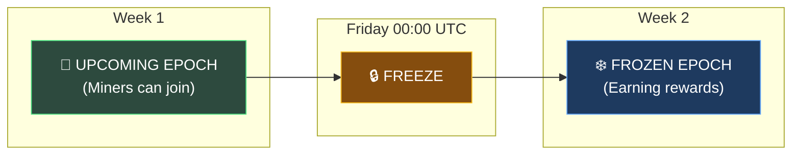
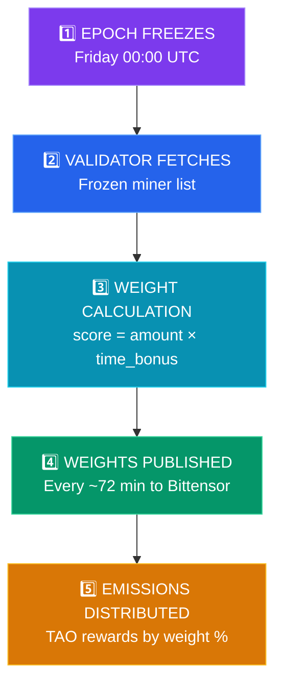
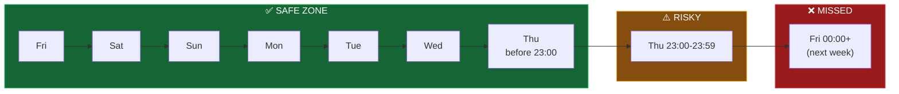

# Weekly Epochs

Understanding the weekly epoch cycle is essential for maximizing your rewards as a miner on Cartha. This guide explains how epochs work, when rewards are calculated, and the best timing for locking your funds.

## What is an Epoch?

An **epoch** is a fixed time period during which miner positions are frozen and rewards are calculated. Cartha uses a **weekly epoch cycle** that runs from Friday to Thursday.

| Property | Value |
|----------|-------|
| **Epoch Start** | Friday 00:00 UTC |
| **Epoch End** | Thursday 23:59:59 UTC |
| **Duration** | 7 days |
| **Epoch Version Format** | ISO8601 (e.g., `2025-02-07T00:00:00Z`) |

## The Weekly Epoch Lifecycle

### Phase 1: Upcoming Epoch (Before Freeze)

During the week **before** the freeze:
- Miners can register, lock funds, and verify their positions
- Positions are added to the **upcoming epoch** list
- No rewards are earned yet - you're preparing for the next cycle
- The verifier tracks all verified miners for the upcoming freeze

### Phase 2: Epoch Freeze (Friday 00:00 UTC)

At exactly **Friday 00:00 UTC**:
- The epoch **freezes** - a snapshot is taken of all verified miners
- The miner list becomes immutable for the week
- New locks after this point go into the **next** upcoming epoch
- Validators fetch the frozen list and calculate weights

### Phase 3: Frozen Epoch (Earning Rewards)

During the frozen epoch (Friday → Thursday):
- Your position is **locked in** and earning rewards
- Weights are calculated once at epoch start
- Validators publish weights to Bittensor every Bittensor epoch (~72 minutes)
- Rewards accumulate based on your locked amount and duration

### Phase 4: Carry-Over

At the next freeze:
- Eligible miners are automatically carried over to the new epoch
- Expired or deregistered positions are removed
- The cycle repeats

## How Miners Get Rewards

### Reward Factors

Your rewards depend on:

| Factor | Description |
|--------|-------------|
| **Locked Amount** | More USDC locked = higher base score |
| **Lock Duration** | Longer locks receive time bonuses |
| **Pool Selection** | Different pools may have different demand |
| **Total Pool Size** | Your share of the total locked liquidity |

### Important: Mid-Epoch Changes Don't Count

- **Top-ups during an epoch**: Added to `pending_amount`, not `scoring_amount`
- **New locks after freeze**: Go into the upcoming epoch, not current
- **Withdrawals**: Can only happen after lock expires

Your `scoring_amount` is fixed at the epoch freeze and doesn't change until the next freeze.

---

## Best Practice: Lock by Thursday (Before 23:00 UTC)

> **Recommendation**: Complete your lock by **Thursday 23:00 UTC** (or earlier) to ensure inclusion in the next epoch.

### Why Give Yourself Buffer Time?

The indexer needs time to detect your position on Base chain. This process can take **up to 15 minutes**. If you lock at 23:50 UTC and the indexer takes 15 minutes, your position won't be verified until 00:05 UTC Friday — **after the freeze**.

### Timing Breakdown

| When You Lock | What Happens |
|---------------|--------------|
| **Thursday before 23:00 UTC** | ✅ Safe! 1+ hour buffer for indexer. Guaranteed inclusion. |
| **Thursday 23:00-23:59 UTC** | ⚠️ Risky! Indexer may not detect in time. No buffer for delays. |
| **Friday 00:00 UTC or later** | ❌ Missed! Already after the freeze. Wait until next week. |

### Indexer Timing

| Step | Time Required |
|------|---------------|
| Transaction confirmation on Base | ~2-10 seconds |
| Indexer detects position | **Up to 15 minutes** |
| Verifier adds to upcoming epoch | ~30 seconds |
| **Total (worst case)** | **~16 minutes** |

**Safe cutoff**: Lock by **Thursday 23:00 UTC** to have a comfortable 1-hour buffer.

### Thursday Checklist

To ensure you're included in the next epoch:

1. **Check your timezone** - Know what time Thursday 23:00 UTC is in your local time
2. **Complete all transactions** - Both approve and lock transactions
3. **Wait for verification** - Allow up to 15 minutes for the indexer + verifier
4. **Confirm "In Next Epoch" status** - Check your position on [My Positions](https://cartha.finance/positions)

### Timezone Reference

| Your Timezone | Thursday 23:00 UTC = |
|---------------|----------------------|
| UTC | Thursday 23:00 |
| EST (New York) | Thursday 18:00 |
| PST (Los Angeles) | Thursday 15:00 |
| CET (Paris) | Friday 00:00 |
| JST (Tokyo) | Friday 08:00 |
| AEST (Sydney) | Friday 10:00 |

> **Note**: For timezones ahead of UTC (Europe, Asia, Australia), "Thursday UTC" is already Friday local time. Plan accordingly!

---

## Position Statuses Explained

| Status | Meaning |
|--------|---------|
| **In Next Epoch** | Verified and will be included in the next freeze |
| **Active** | Currently in the frozen epoch, earning rewards |
| **Pending Verification** | Lock detected, waiting for verifier confirmation |
| **Expired** | Lock period ended, can be withdrawn |

## Epoch Version Format

Each epoch is identified by its start timestamp in ISO8601 format:

**Example**: `2025-02-07T00:00:00Z`

| Part | Meaning |
|------|---------|
| `2025-02-07` | Date (always a Friday) |
| `T00:00:00Z` | Time (always midnight UTC) |

- Always starts on a **Friday**
- Always at **00:00:00 UTC**
- Used by validators and verifier APIs

---

## Frequently Asked Questions

### What happens if I lock on Friday at 00:01 UTC?

You missed the freeze by 1 minute. Your position goes into the **next** upcoming epoch, meaning you'll wait until the following Friday to start earning.

### Can I add more funds during an epoch?

Yes, but top-ups go into `pending_amount` and don't count toward your current epoch score. They'll be included in the next epoch's `scoring_amount`.

### What if my lock expires mid-epoch?

Expired positions are removed at the daily check (00:00 UTC). You'll need to create a new lock to participate in future epochs.

### How do I know I'm in the frozen epoch?

Check your position status on [My Positions](https://cartha.finance/positions):
- **Active** = You're in the frozen epoch, earning rewards
- **In Next Epoch** = You're verified for the upcoming freeze

### Why is my position showing "In Next Epoch" for days?

This is normal! You're verified and waiting for the next Friday freeze. Once Friday 00:00 UTC arrives, your status will change to "Active" and you'll start earning.

---

## Summary

| Key Point | Details |
|-----------|---------|
| **Epoch Duration** | Friday 00:00 UTC → Thursday 23:59 UTC (7 days) |
| **Freeze Time** | Friday 00:00 UTC |
| **Best Time to Lock** | Thursday before 23:00 UTC (1-hour buffer for indexer) |
| **Rewards Start** | After your first freeze (when status = Active) |
| **Weight Calculation** | Once per epoch at freeze time |
| **Weight Publishing** | Every Bittensor epoch (~72 min) |

---

**Ready to lock?** Visit [https://cartha.finance](https://cartha.finance) and lock by Thursday to be included in the next epoch!
