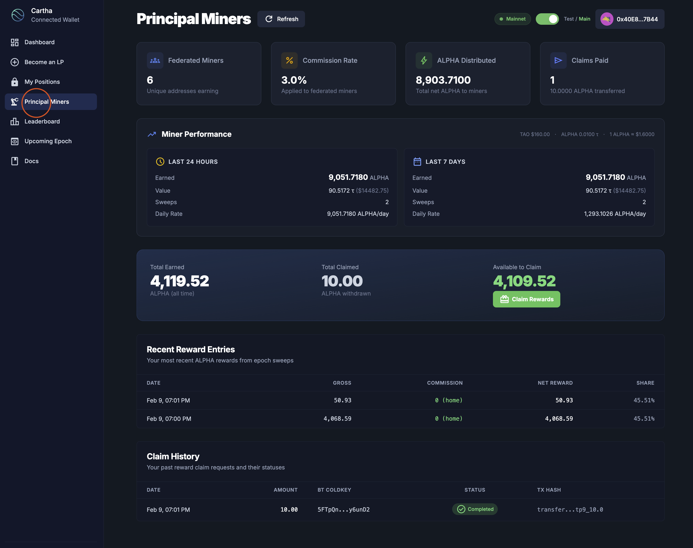
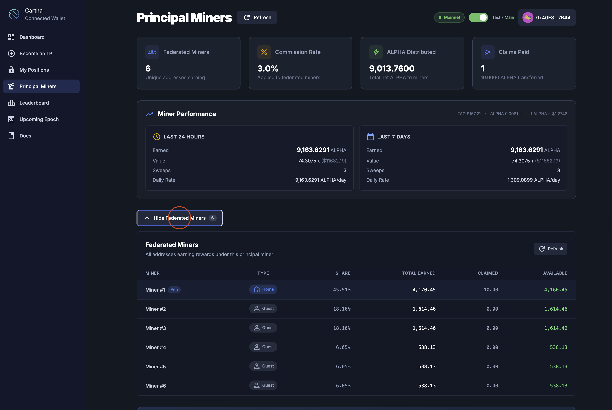
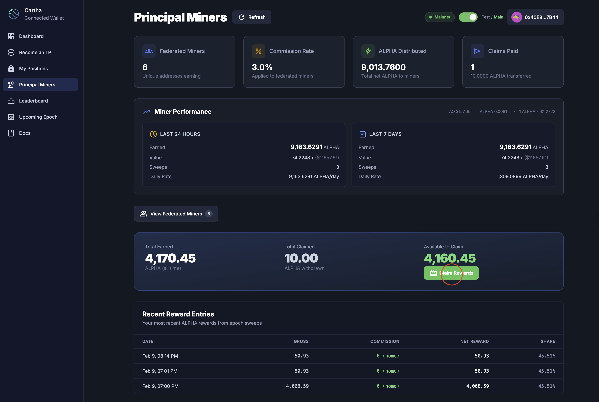
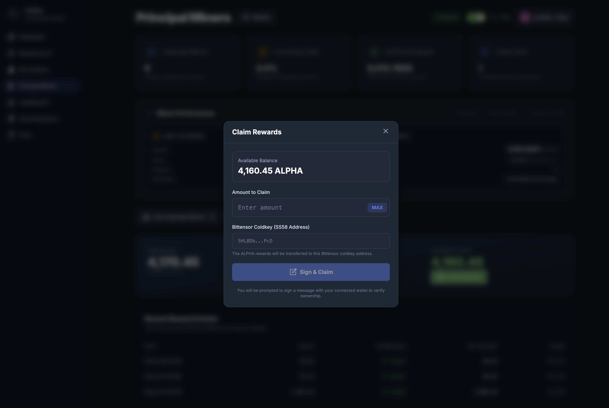
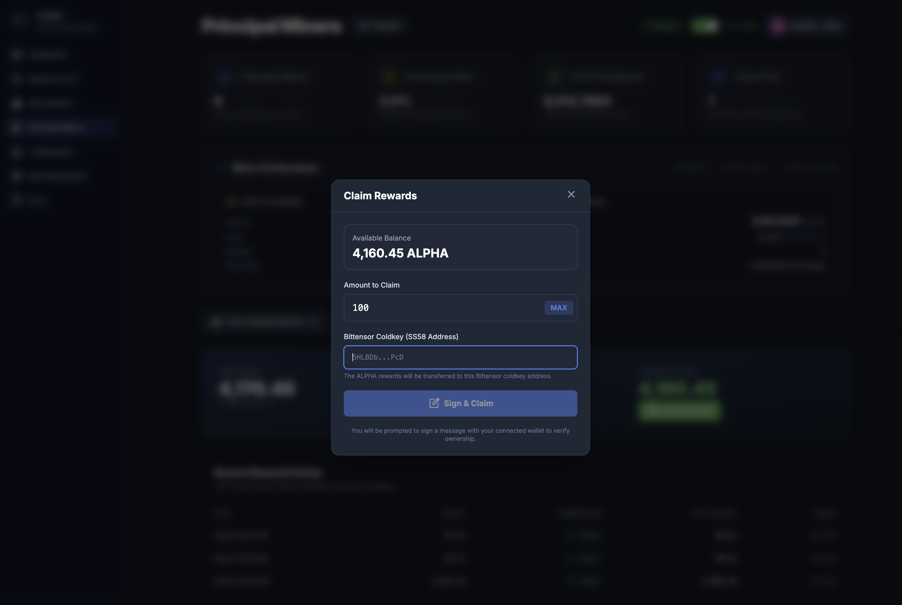
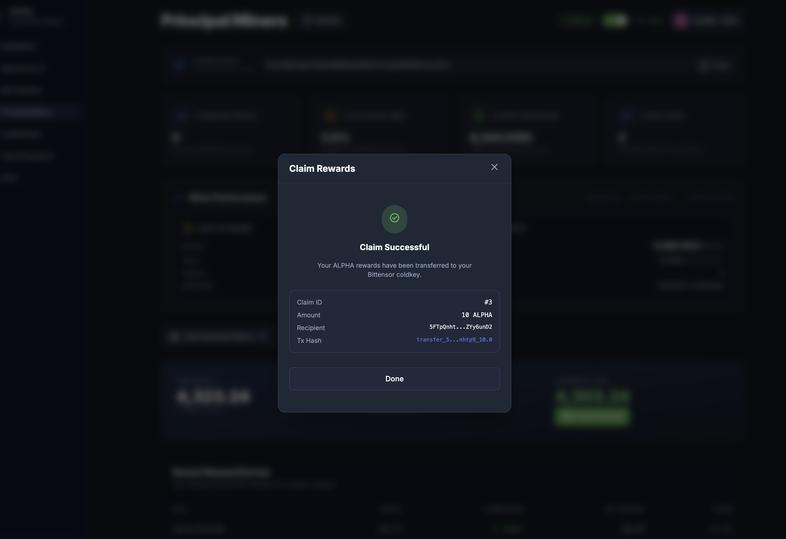

# Federated Miner Guide

Complete guide to becoming a **federated miner** on the 0xMarkets Liquidity Engine — no CLI required, everything done through the web interface.

- **Web interface:** [https://liquidity.0xmarkets.io](https://liquidity.0xmarkets.io)

## What a federated miner is

A federated miner provides liquidity by depositing USDC into a **principal miner's vault**, using only an EVM wallet. You don't register on Bittensor Subnet 35 or run any CLI tools. You keep full ownership of your position on-chain, and you earn a share of the principal miner's ALPHA emissions (minus their commission), plus your proportional share of trading-fee yield.

**Why this exists:** running a principal miner means a Bittensor hotkey, subnet registration, and infrastructure. Federated mining lets anyone with USDC and an EVM wallet provide liquidity without that complexity. You lock through a registered principal miner's hotkey; the emissions for the whole vault flow to that miner first, and they distribute your share.

### What you control vs what you don't

| You control | You don't control |
|---|---|
| Position ownership (via your EVM wallet) | ALPHA emissions routing (sent to the principal miner's Bittensor wallet first, then distributed) |
| Withdrawal after lock expiry — no principal-miner approval needed | Pool performance (the market your vault backs) |
| Locking independently (no CLI or coordination) | Liquidation events (market-driven from DEX activity) |

> **Your USDC is non-custodial.** It sits in the vault smart contract, not the principal miner's wallet. The principal miner cannot access, move, or withdraw your committed funds — only you can, after lock expiry.

### The core trust assumption

ALPHA emissions for the vault arrive in the **principal miner's** Bittensor wallet, then get distributed to federated miners. This is the one trust dependency in the model. To reduce it, lock to a principal miner that runs **automated distribution** — rewards are calculated per epoch and you claim them directly from the dashboard, with no manual transfer to rely on. **General Tensor**, the team-operated principal miner, works this way and is the recommended starting point for new federated miners (commission as shown on its dashboard).

**What you'll do:**

1. Set up an EVM wallet on Base with ETH and USDC
2. Choose a deposit method and lock your funds
3. Monitor your position and the principal miner's performance
4. Claim ALPHA rewards to a Bittensor coldkey

## How to deposit

There are **two ways** to lock funds as a federated miner:

### Option A: Deposit via a trusted principal miner (recommended)

Browse the **Principal Miners** page, choose a trusted and verified principal miner, and lock directly from their dashboard. No need to find or copy a hotkey yourself. Principal miners charge a commission on your rewards (e.g. 3%).

**[Deposit via Trusted Principal Miner →](federated-miner-deposit-principal.md)**

### Option B: Direct deposit (any hotkey)

If you already have a principal miner's hotkey (SS58 address), paste it directly into the **"Become an LP"** form. Useful when you want to lock through a specific miner that may not be listed on the Principal Miners page.

**[Direct Deposit (Any Hotkey) →](federated-miner-deposit-direct.md)**

---

## Prerequisites

Before you begin, ensure you have:

- ✅ **EVM wallet** installed (MetaMask, Coinbase Wallet, Rabby, etc.)
- ✅ **Base mainnet** network added to your wallet
- ✅ **Base ETH** for gas fees
- ✅ **Base USDC** for liquidity provision

> You do **not** need a Bittensor wallet, Python, or any CLI tools to lock funds. You only need a Bittensor coldkey later, when claiming ALPHA rewards.

---

## Step 1: Set up your wallet

### Add Base mainnet to your wallet

If Base isn't already in your wallet, add it manually:

```
Network Name: Base
RPC URL: https://mainnet.base.org
Chain ID: 8453
Currency Symbol: ETH
Block Explorer URL: https://basescan.org
```

**Quick add:** visit [Chainlist](https://chainlist.org/), search "Base", and click "Add to MetaMask".

### Get ETH (for gas)

- Bridge ETH from Ethereum mainnet using the [Base Bridge](https://bridge.base.org/)
- Or transfer from a centralized exchange that supports Base withdrawals

### Get USDC (for liquidity)

- Bridge USDC from Ethereum mainnet using the [Base Bridge](https://bridge.base.org/)
- Or transfer from a centralized exchange that supports Base USDC withdrawals

---

## Step 2: Lock your funds

Choose one of the two deposit methods:

- **[Deposit via Trusted Principal Miner](federated-miner-deposit-principal.md)** — browse and pick a verified miner (recommended)
- **[Direct Deposit (Any Hotkey)](federated-miner-deposit-direct.md)** — paste a hotkey manually via "Become an LP"

---

## Step 3: Principal miner dashboard

Once your funds are locked, monitor your principal miner's performance and your own rewards from the **Principal Miners** page.

### Accessing the dashboard

1. Click **"Principal Miners"** in the left navigation bar
2. The dashboard shows the principal miner you're federated under



### Dashboard overview

The top cards give you a quick summary:

| Card | What it shows |
|------|---------------|
| **Federated Miners** | How many unique addresses are currently earning under this principal miner |
| **Commission Rate** | The percentage the principal miner takes from federated rewards (e.g. 3.0%) |
| **ALPHA Distributed** | Total net ALPHA distributed to all miners under this hotkey to date |
| **Claims Paid** | Number of completed ALPHA claim transactions |

### Miner performance

The **Miner Performance** section shows earnings over two windows:

- **Last 24 Hours** — ALPHA earned, estimated TAO/USD value, number of sweeps, and daily rate (ALPHA/day)
- **Last 7 Days** — same metrics over a weekly window

This helps you track how actively the principal miner is earning and whether performance is consistent.

### Your earnings summary

Below the performance section:

- **Total Earned** — all ALPHA you've accumulated (all time)
- **Total Claimed** — ALPHA you've already withdrawn
- **Available to Claim** — ALPHA ready to claim right now

The green **"Claim Rewards"** button withdraws your available ALPHA.

### Recent reward entries

A table of your most recent ALPHA rewards from epoch sweeps:

| Column | Description |
|--------|-------------|
| **Date** | When the reward was swept |
| **Gross** | Total ALPHA before commission |
| **Commission** | Commission taken (shows "0 (home)" for the principal miner's own position) |
| **Net Reward** | ALPHA you actually receive |
| **Share** | Your percentage share of the total pool rewards |

### Claim history

A record of past claims showing date, amount, Bittensor coldkey used, status (Completed/Pending), and transaction hash.

### Federated miner list

Click **"View Federated Miners"** to expand the list of all addresses earning under this principal miner.



Each entry shows:

| Column | Description |
|--------|-------------|
| **Miner** | Position identifier (Miner #1, #2, etc.) with a "You" badge on your own position |
| **Type** | **Home** (principal miner's own position) or **Guest** (federated miner) |
| **Share** | Your percentage share of the pool |
| **Total Earned** | ALPHA earned by this position |
| **Claimed** | ALPHA already claimed |
| **Available** | ALPHA available to claim |

---

## Step 4: Claim ALPHA rewards

To claim, you need a **Bittensor coldkey** (SS58 address) — where the ALPHA tokens are sent on the Bittensor network.

> 📹 **Video walkthrough:** see **[How to Claim Rewards](claim-rewards.md)** for a quick video guide.

### Get a Bittensor wallet

If you don't already have one, create it either way:

**Option 1: Talisman browser extension (recommended)**

[Talisman](https://www.talisman.xyz/) is the easiest way to get a Bittensor wallet — no CLI needed. It's a browser extension supporting Bittensor (Substrate) accounts.

1. Install the [Talisman extension](https://www.talisman.xyz/) for Chrome, Firefox, or Edge
2. Create a new wallet and **save your recovery phrase securely**
3. Add a Bittensor account (Substrate-based)
4. Copy your **coldkey SS58 address** (starts with `5`)

**Option 2: Bittensor CLI (btcli)**

```bash
pip install bittensor-cli
btcli wallet create
```

This creates both a coldkey and hotkey. Save your mnemonic — you cannot recover your wallet without it. See the [Bittensor CLI docs](https://docs.learnbittensor.org/btcli).

### Claiming your rewards

1. Navigate to **"Principal Miners"**
2. Scroll to your earnings summary and click the green **"Claim Rewards"** button



3. The **Claim Rewards** modal appears, showing your available ALPHA balance



4. **Enter the amount** to claim (or click **MAX** for the full balance)

5. **Paste your Bittensor coldkey** (SS58 address) — where the ALPHA will be transferred



6. Click **"Sign & Claim"** — you'll sign a message with your connected EVM wallet to verify ownership

7. Once confirmed, you'll see a **"Claim Successful"** confirmation with the Claim ID, amount, recipient coldkey, and transaction hash



8. Click **"Done"** to close. Track all claims in the **Claim History** section.

---

## Managing your position

<figure><figcaption>My Positions page showing Portfolio Summary with P&amp;L, position cards with miner name, and quick actions</figcaption></figure>

### Top up (add more USDC)

1. Go to **"My Positions"**
2. Click **"Top Up"** on your position
3. Enter the additional USDC amount
4. Confirm the transaction

### Extend lock duration

1. Go to **"My Positions"**
2. Click **"Extend"** on your position
3. Choose a new (longer) lock duration
4. Confirm the transaction

Extending increases your deposit score, which means a larger share of ALPHA emissions.

### Withdraw after expiry

Once your lock period and the 7-day cooldown have both passed, your position shows as **Expired** with a **"Ready to withdraw"** status.

1. Go to **"My Positions"**
2. Your expired position displays the status, withdrawable amount, and a **"Withdraw"** button


3. Click **"Withdraw"** — a confirmation modal shows:
   - Pool and lock duration
   - Expiration date and status
   - Total committed and the amount you will receive
   - Cooldown status (must show **Ready**)
   - Position owner and connected-wallet match verification


4. Click **"Confirm Full Withdrawal"** and approve in your wallet
5. Your USDC is returned to your connected EVM wallet

**Note:** there is a mandatory 7-day cooldown from the initial lock start. You can only withdraw after both the lock period and cooldown have passed. See [How to Withdraw](how-to-withdraw.md).

### Multiple positions

- ✅ Same hotkey + same pool + **different EVM wallet** → creates a separate position
- ❌ Same hotkey + same pool + **same EVM wallet** → use "Top Up" instead

---

## Choosing a principal miner

The simplest start is **General Tensor**, the principal miner operated by the 0xMarkets team: automated per-epoch distribution, a publicly displayed commission rate, and self-service claiming from the dashboard. Copy its hotkey from the [Principal Miners page](https://liquidity.0xmarkets.io/principal-miners), or pick it directly when locking.

If you prefer another operator, evaluate them on:

- **Track record** — past performance and distribution history
- **Commission rate** — the percentage taken from your rewards
- **Distribution method** — automated vs manual
- **Communication** — active, responsive channels

**Red flags:** promises of guaranteed returns · requests for capital outside the 0xMarkets liquidity vaults · refusal to disclose commission or terms · no track record.

> The 0xMarkets Liquidity Engine does **not** enforce off-chain profit-sharing agreements on-chain. For any principal miner *not* using automated distribution, you rely on their agreement and reputation — which is why a trusted, automated operator matters.

---

## Important notes

### Rewards & weekly epochs

- **ALPHA emissions** — based on your deposit score (`amount × min(lock_days, 365) / 365`)
- **Trading-fee yield** — 50% of trading fees go to the LP pool, raising vault NAV proportional to your locked USDC
- The Liquidity Engine runs a **7-day epoch cycle**: Friday 00:00 UTC → Thursday 23:59 UTC
- **Best practice:** lock by **Thursday 23:00 UTC** to be included in the next epoch
- The indexer needs up to 15 minutes to detect your position — give yourself buffer
- Positions locked after Friday 00:00 UTC go into the *following* week's epoch

> 📘 See [Weekly Epochs](../how-it-works/weekly-epochs.md) for the full epoch-timing and reward-calculation guide.

### Transaction requirements

- ✅ Connected to **Base mainnet** (Chain ID: 8453)
- ✅ ETH for gas fees
- ✅ USDC in your wallet
- ✅ Two transactions to lock: Approve + Lock

---

## Available pools

| Pool | Vault token | Address |
|---|---|---|
| BTC/USD | cvBTC | [`0xD090239EaE0d756726b6afd57E0b23A24FCABe86`](https://basescan.org/address/0xD090239EaE0d756726b6afd57E0b23A24FCABe86) |
| ETH/USD | cvETH | [`0x47EbDBE398733664250356F7F19fd516a5f1Dd0a`](https://basescan.org/address/0x47EbDBE398733664250356F7F19fd516a5f1Dd0a) |
| TAO/USD | cvTAO | [`0x47C563FFa0aB3e952561a72D3F09ec2c8ADb7FD5`](https://basescan.org/address/0x47C563FFa0aB3e952561a72D3F09ec2c8ADb7FD5) |
| GOLD/USD | cvGOLD | [`0xabc777A16E41CF6E2F02A768D1f9f4d8aa68e58F`](https://basescan.org/address/0xabc777A16E41CF6E2F02A768D1f9f4d8aa68e58F) |
| SILVER/USD | cvSILVER | [`0x48682e7Bf092219e27D27F7A8d01b2538A828998`](https://basescan.org/address/0x48682e7Bf092219e27D27F7A8d01b2538A828998) |
| EUR/USD | cvEUR | [`0x8AE6DDb449b3D8d1fE961483Fbe1329b5e4cbD86`](https://basescan.org/address/0x8AE6DDb449b3D8d1fE961483Fbe1329b5e4cbD86) |
| GBP/USD | cvGBP | [`0x9Eed917485e08FdFee977629bf933E8C0B33e539`](https://basescan.org/address/0x9Eed917485e08FdFee977629bf933E8C0B33e539) |
| JPY/USD | cvJPY | [`0xf2e3f581A7dE8B055c0122E3bFb445A67b485831`](https://basescan.org/address/0xf2e3f581A7dE8B055c0122E3bFb445A67b485831) |

**Network:** Base mainnet (Chain ID: 8453)

---

## Troubleshooting

### "Transaction failed" in wallet

- **Network** — make sure you're on Base mainnet (Chain ID: 8453)
- **Gas** — ensure you have enough ETH
- **USDC balance** — ensure you have enough USDC
- **Approval** — make sure the approval transaction completed before locking
- **Wait and retry** — network congestion may cause delays

### Position not showing after locking

- Wait 30 seconds to 5 minutes for the indexer to process your lock
- Click the **Refresh** button on "My Positions"
- If it still doesn't appear after 5 minutes, check the transaction on [BaseScan](https://basescan.org/)

### "Position already exists"

- Use **Top Up** to add more USDC to your existing position
- Use **Extend** to increase lock duration
- Or use a different EVM wallet to create a separate position

### Claim not processing

- Ensure you entered a valid Bittensor coldkey (SS58 address starting with `5`)
- Check the EVM signature completed successfully
- Track claim status in the **Claim History** section

---

## Quick start checklist

- [ ] EVM wallet installed (MetaMask, Coinbase Wallet, etc.)
- [ ] Base mainnet network added
- [ ] ETH on Base (for gas)
- [ ] USDC on Base (for liquidity)
- [ ] Deposited via one of the two methods:
  - [ ] [Trusted Principal Miner](federated-miner-deposit-principal.md) (recommended)
  - [ ] [Direct Deposit (Any Hotkey)](federated-miner-deposit-direct.md)
- [ ] Position confirmed on [My Positions](https://liquidity.0xmarkets.io/manage)
- [ ] Bittensor coldkey ready (for claiming ALPHA)

---

## Next

- [Deposit via Principal Miner](federated-miner-deposit-principal.md) — step-by-step locking (recommended)
- [Direct Deposit (Any Hotkey)](federated-miner-deposit-direct.md) — paste a hotkey manually
- [Principal Miner Dashboard](principal-miner-dashboard.md) — track your earnings
- [How to Claim Rewards](claim-rewards.md) — video walkthrough
- [Weekly Epochs](../how-it-works/weekly-epochs.md) · [Fees & Rewards](../how-it-works/fees-and-rewards.md)
- [FAQ](../reference/faq.md) · [Risk disclosures](../security/risk-disclosures.md)

### Support

- **Discord:** https://0xmarkets.io/discord
- **Website:** https://liquidity.0xmarkets.io
- **Email:** support@0xmarkets.io
