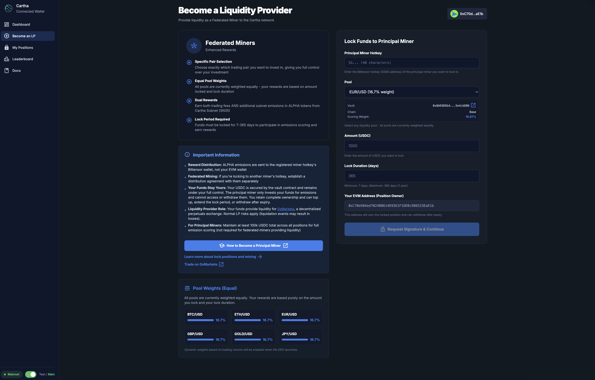
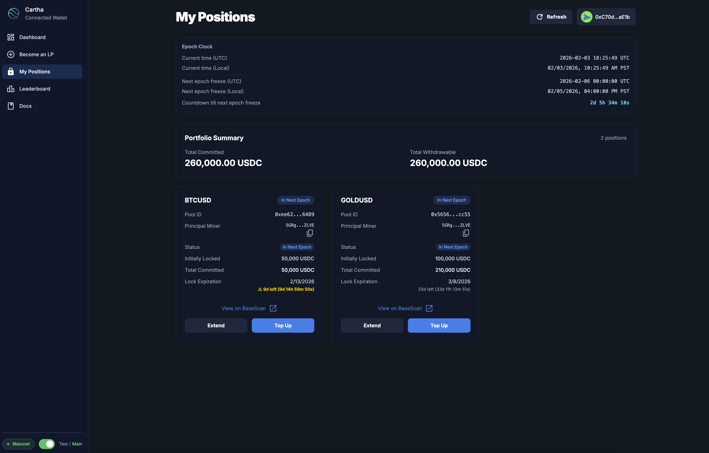
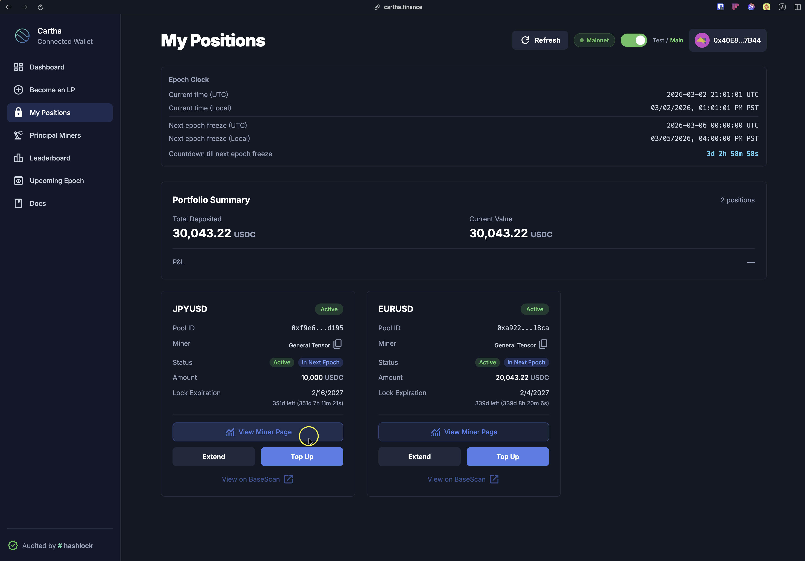
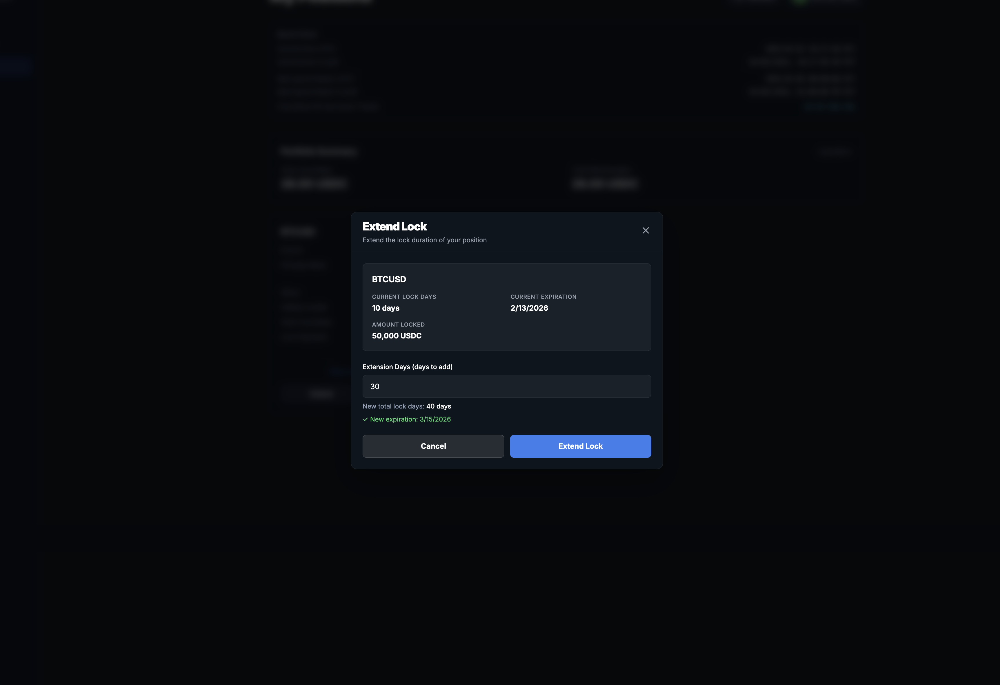
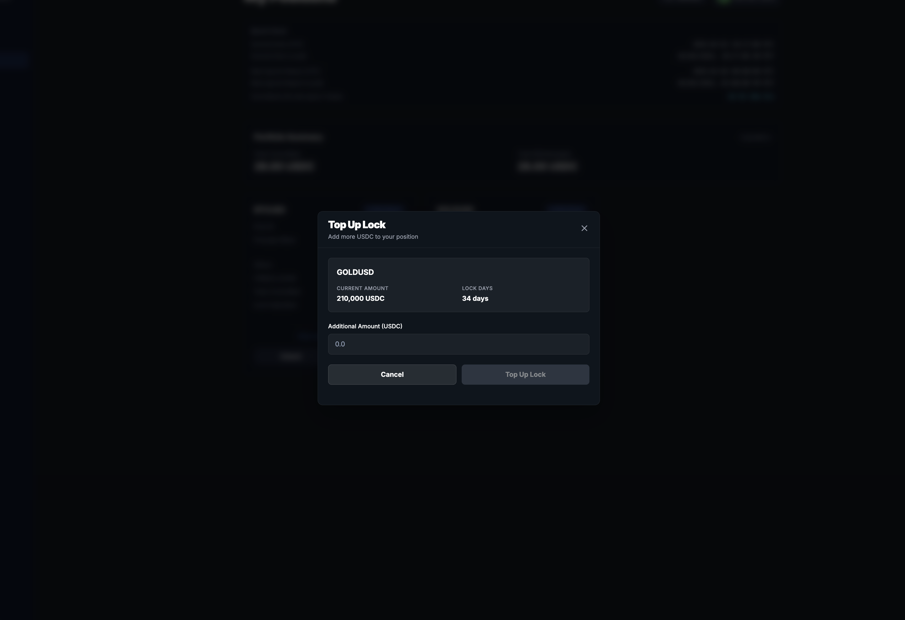
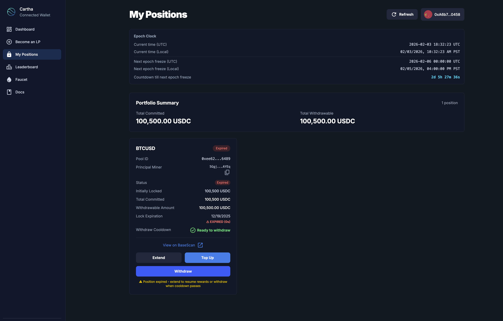
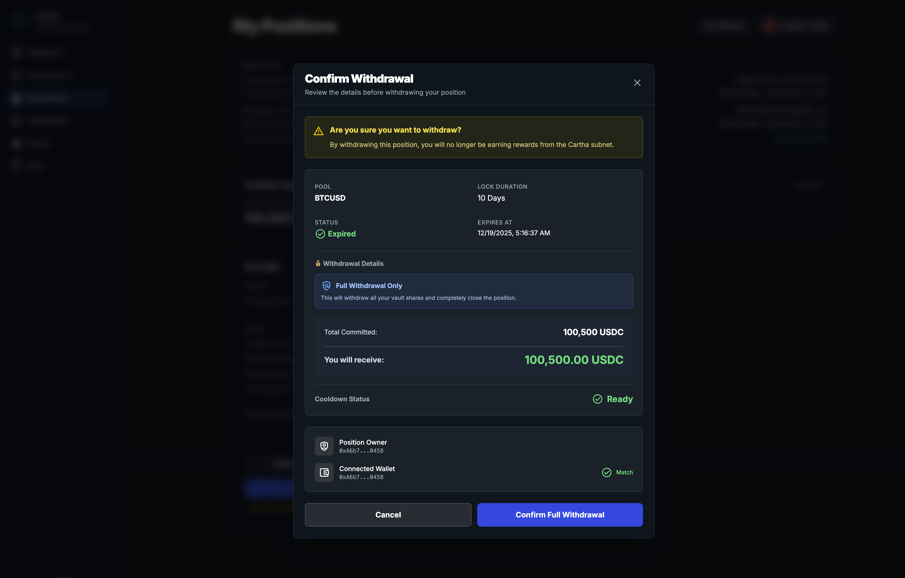

# The Liquidity Interface

**A web interface for creating and managing your liquidity lock positions.** It replaces manual contract calls on BaseScan with a guided, wallet-connected flow for locking USDC, viewing positions, topping up, extending, and withdrawing.

**URL:** [https://liquidity.0xmarkets.io](https://liquidity.0xmarkets.io/)

## What it is

The Liquidity Interface is a web app that simplifies creating and managing lock positions on the **0xMarkets Liquidity Engine** (Bittensor Subnet 35). Instead of copying transaction data and executing contracts on a block explorer, the interface walks you through each step with clear parameters and automatic wallet integration.

### Key benefits

* ✅ **No BaseScan required** — execute every transaction directly in the UI
* ✅ **Multi-wallet support** — MetaMask, Coinbase Wallet, Talisman, and WalletConnect
* ✅ **Automatic validation** — checks you're using the correct wallet address
* ✅ **Real-time status** — transaction status and confirmations as they happen
* ✅ **Position management** — all your positions in one place
* ✅ **Clean design** — intuitive dark-theme interface

## What you can do

### 1. Create new lock positions

The primary use of the interface is creating new lock positions.



The process is split into two phases.

#### Phase 1: Approve USDC

1. **Start from the CLI** (principal miners): run `0xmarkets vault lock` with your parameters, and the CLI opens the UI with everything pre-filled. Federated miners can start directly in the UI instead.
2. **Connect your wallet** — MetaMask, Coinbase Wallet, Talisman, or WalletConnect
3. **Wallet validation** — the UI verifies your connected wallet matches the required owner address
4. **Approve transaction** — review the approval details and execute
5. **Automatic detection** — the flow detects when the approval completes

**What you'll see:** required owner address vs your connected wallet, the USDC contract and spender (vault) address, the amount to approve, copy buttons, and live status indicators.

#### Phase 2: Lock position

After Phase 1 completes, you proceed to Phase 2 automatically:

1. **Review lock details** — pool, amount, lock days, hotkey, unlock date
2. **Confirm transaction** — review before executing
3. **Execute lock** — sign and submit
4. **Success confirmation** — a link to view your positions

**What you'll see:** pool ID and name, lock amount (USDC), lock duration, unlock date, hotkey address, owner vs connected-wallet comparison, and transaction status with a BaseScan link.

### 2. View your positions

Navigate to **"My Positions"** (or visit `/manage`) to see all your active lock positions.



<figure><figcaption>My Positions page showing Portfolio Summary with P&amp;L, position cards with miner name, and quick actions</figcaption></figure>

**Features:**

* **All positions at a glance** — every pool in one dashboard
* **Portfolio summary** — total deposited, current vault value, and real-time P&L across all positions
* **Position details** — for each: pool name (e.g. BTC/USD, ETH/USD, EUR/USD), amount locked (USDC), lock duration (days), expiration date with countdown, status (Active, In Next Epoch, etc.), and the EVM address used for the lock
* **Status indicators** — color-coded status badges
* **Quick actions** — Extend and Top Up buttons per position
* **View Miner Page** — for federated positions under a principal miner, a direct link to their dashboard to monitor earnings and claim ALPHA
* **Refresh button** — manually refresh to see the latest status

**Access methods:** click "My Positions" on the landing page, navigate to `/manage` directly, or click "View My Positions" after creating a lock.

### 3. Extend lock duration

Extend the duration of an existing lock.



1. Go to **My Positions**
2. Click **"Extend"** on the position
3. Select how many additional days to add
4. Review and confirm
5. Sign and submit

A longer lock raises your deposit score and your share of ALPHA emissions. See [How to Top Up & Extend](how-to-top-up-and-extend.md).

### 4. Top up existing positions

Add more USDC to an existing lock.



1. Go to **My Positions**
2. Click **"Top Up"** on the position
3. Enter the additional USDC amount
4. Approve USDC if needed
5. Review, confirm, and submit

### 5. Withdraw (after lock expires)

Once your lock has expired and the **7-day cooldown** has passed, you can withdraw your USDC.

When a position expires its status changes to **"Expired"** and the **Withdraw** button appears below Extend and Top Up.



1. Go to **My Positions**
2. Find the position with the "Expired" badge
3. Click **"Withdraw"**
4. Review the withdrawal details — the popup shows the total you'll receive



5. Click **"Confirm Full Withdrawal"**
6. Sign the transaction in your wallet

**Note:** the Withdraw button only appears after your lock has fully expired *and* the cooldown has passed. While the lock is active you'll only see Extend and Top Up. See [How to Withdraw](how-to-withdraw.md).

## How it works with the CLI

Principal miners can drive the interface from the CLI. (Federated miners don't need the CLI — they lock directly in the UI.)

### Starting from the CLI

```bash
0xmarkets vault lock \
  --coldkey my-coldkey \
  --hotkey my-hotkey \
  --pool-id BTCUSD \
  --amount 100000.0 \
  --lock-days 30 \
  --owner-evm 0xYourEVMAddress
```

**What happens:**

1. CLI authenticates with your Bittensor hotkey
2. CLI requests a signature from the verifier
3. CLI opens the UI in your browser, pre-filled with all parameters
4. You complete the transactions in the UI
5. CLI monitors the Phase 1 approval automatically
6. The verifier detects the Phase 2 lock automatically

### Direct access

You can also use the UI directly:

* **Landing page:** https://liquidity.0xmarkets.io
* **My Positions:** https://liquidity.0xmarkets.io/manage

When accessing directly you connect your wallet manually and navigate to the feature you want. Federated miners lock directly in the UI; principal miners are best served creating locks through the CLI for proper signature generation.

## Supported wallets

* **MetaMask** — most popular EVM wallet
* **Coinbase Wallet** — Coinbase's official wallet
* **Talisman** — recommended Bittensor/Polkadot wallet (browser extension)
* **WalletConnect** — connect any WalletConnect-compatible wallet

**Network requirement:** all wallets must be on **Base mainnet** (Chain ID: 8453).

## Security features

### Wallet address validation

* **Required owner check** — compares the connected wallet with the required owner address
* **Visual warnings** — clear indicators when addresses don't match
* **Disconnect/reconnect** — easy buttons to switch to the correct wallet
* **Error prevention** — blocks transactions from the wrong wallet

### Transaction safety

* **Clear parameter display** — all parameters shown before execution
* **Copy buttons** — for addresses and values
* **Transaction status** — real-time updates with BaseScan links
* **Error handling** — clear messages if a transaction fails

## Navigation

* **Landing page** — home page with the CLI command and quick access to positions
* **Sidebar** — persistent sidebar on dashboard pages with logo and wallet status
* **Breadcrumbs** — clear navigation paths between pages
* **Leaderboard** — combined page at `/leaderboard` with two tabs:
  * **Current Epoch** — live miner rankings, position distribution chart, and your positions
  * **Upcoming Epoch** — preview of next week's rankings plus the Earning Simulator

## Troubleshooting

### "Wrong Network" error

1. Check your wallet is on Base mainnet (Chain ID: 8453)
2. Switch networks in your wallet
3. Refresh the page

### "Wallet Address Mismatch" warning

1. Click "Disconnect"
2. Connect the wallet that matches the `--owner-evm` address
3. Verify the address matches before proceeding

### "Transaction Failed" error

* **Network** — ensure you're on Base mainnet
* **Gas** — ensure you have enough ETH
* **Balance** — ensure you have enough USDC
* **Approval** — for Phase 2, ensure Phase 1 approval completed
* **Congestion** — wait a moment and retry

### Positions not showing

1. Ensure your wallet is connected
2. Verify you're using the correct wallet address
3. Click "Refresh" to reload positions
4. Confirm your locks were created on-chain
5. Verify the indexer has detected your locks (give it up to a few minutes)

## Best practices

**Creating locks:** verify the wallet address matches before approving · check you're on Base mainnet · have ETH ready for both the approval and lock transactions · don't close the UI until transactions confirm.

**Managing positions:** check "My Positions" regularly to monitor expiration dates · extend before locks expire to avoid interruption · use Refresh if positions look outdated.

**Security:** always use the official URL `https://liquidity.0xmarkets.io` · verify all addresses before signing · review parameters before executing.

## Getting help

* **Documentation:** see [Become a Liquidity Provider](miner-guide.md) for setup instructions
* **Discord:** https://0xmarkets.io/discord

## Next

- [Become a Liquidity Provider](miner-guide.md) — choose your path and get started
- [Federated Miner Guide](federated-miner-guide.md) — lock through an existing miner
- [How to Top Up & Extend](how-to-top-up-and-extend.md)
- [How to Withdraw](how-to-withdraw.md)
