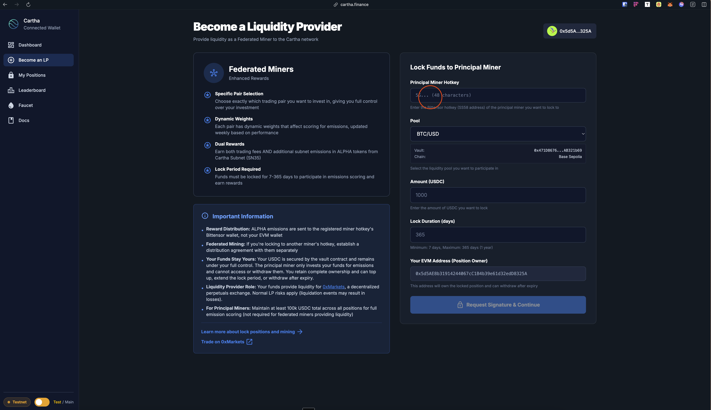
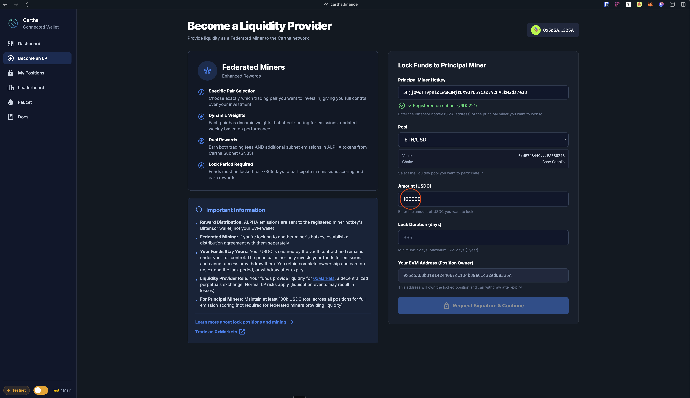
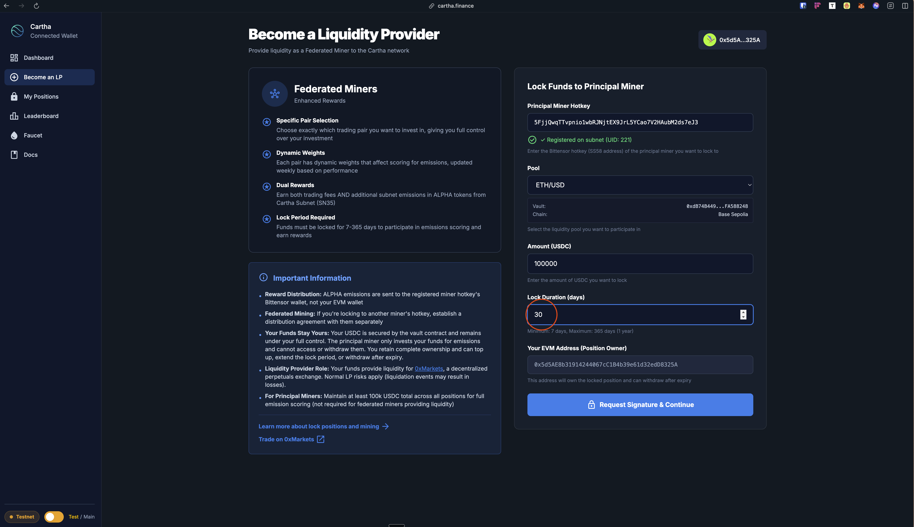
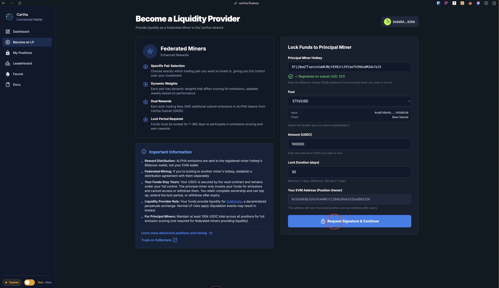
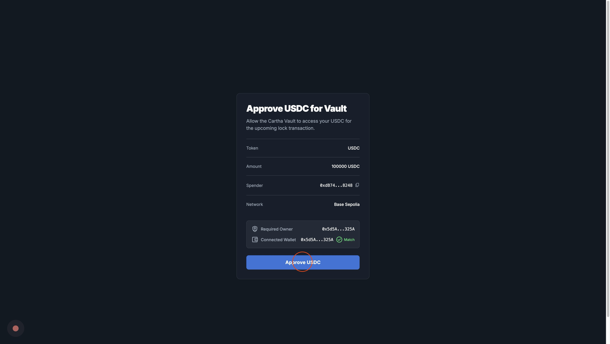
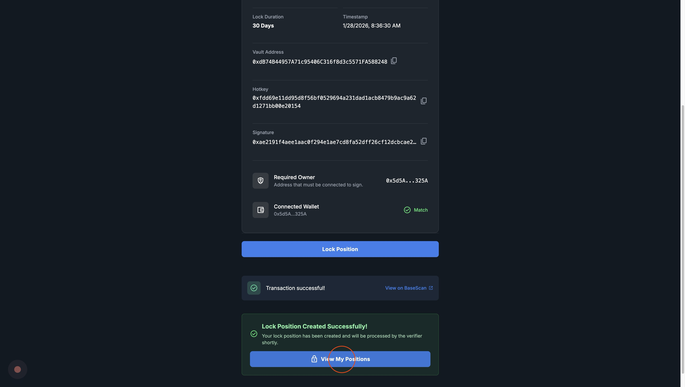
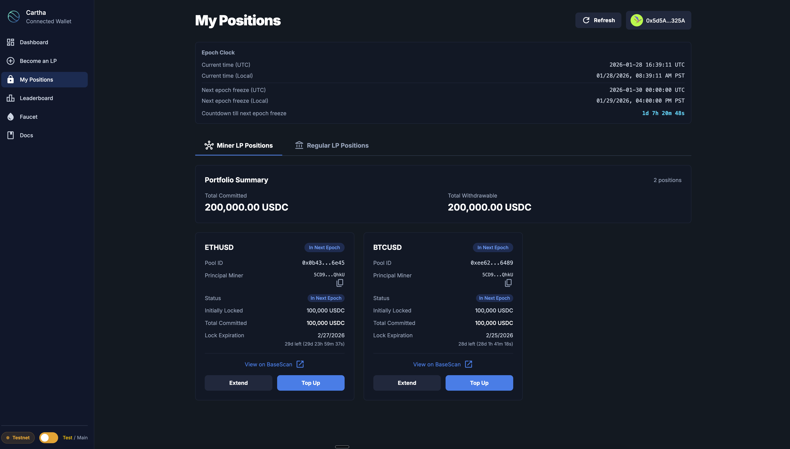
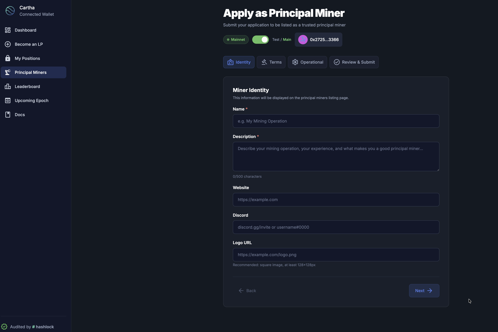
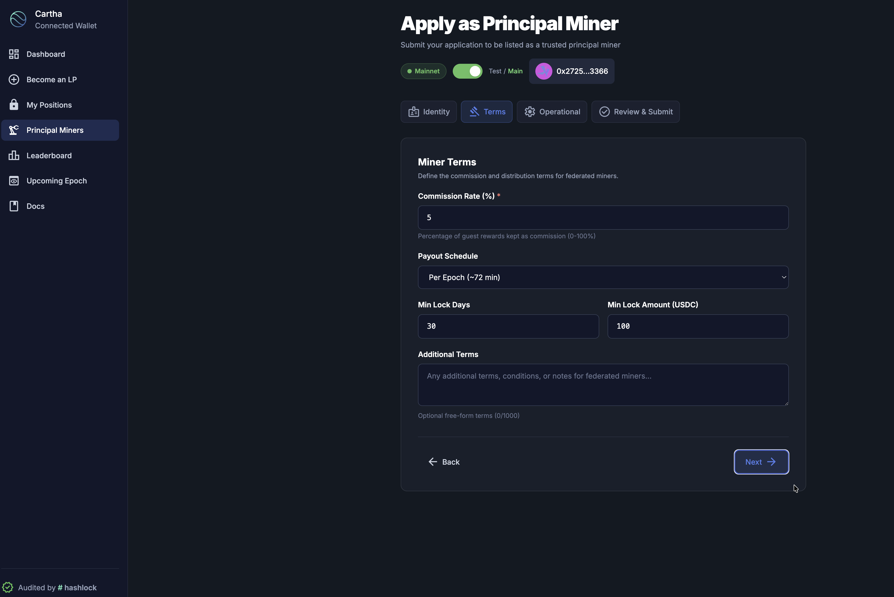
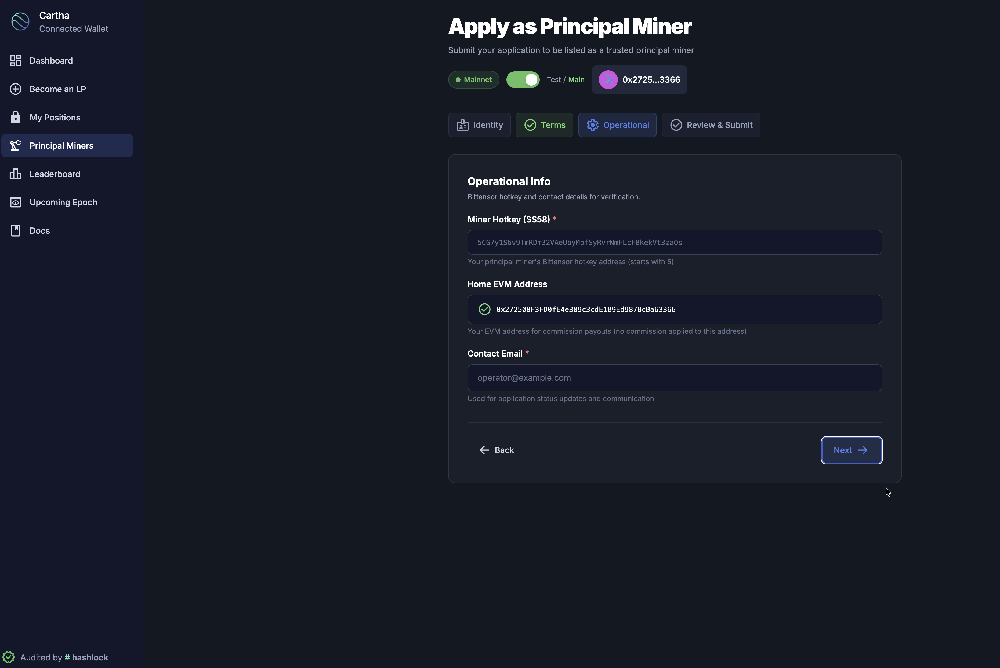

# Principal Miner Guide

A principal miner runs a registered Bittensor hotkey on **Bittensor Subnet 35 (SN35)** — the network behind the **0xMarkets Liquidity Engine** — and locks **USDC** on Base to provide the liquidity that traders on [0xMarkets](https://0xmarkets.io) trade against. This guide takes you end-to-end: create a hotkey, register, lock capital, and (optionally) run the rewards service that lets federated miners lock alongside you and claim their share.

- **Web interface:** [liquidity.0xmarkets.io](https://liquidity.0xmarkets.io)
- **CLI:** [`cartha-cli` on PyPI](https://pypi.org/project/cartha-cli/) · [GitHub](https://github.com/General-Tao-Ventures/cartha-cli)
- **Rewards template:** [principal-miner-template](https://github.com/General-Tao-Ventures/cartha-principal-miner-template)

> **Beta.** The liquidity engine is live and functional but still maturing. Expect occasional rough edges, and verify your positions on-chain after every action.

---

## What a principal miner does

Liquidity providers on 0xMarkets are **capital providers** — you supply USDC, you do not quote or set prices. Pricing is handled entirely by the protocol's [Pyth Pro](../trading/pricing-and-oracle.md) oracle plus an on-chain price-impact model. Your job is to lock capital and keep it committed; the more USDC you lock and the longer you lock it for, the higher your score.

You can run in two modes:

| Mode | Description |
|------|-------------|
| **Private (solo)** | Lock only your own capital and keep 100% of the emissions your hotkey earns. |
| **Public (principal)** | Let federated miners lock USDC alongside you, charge a commission on their rewards, and run a service that aggregates and distributes those rewards. |

Most operators start private and switch to public once they are comfortable running the service.

### The principal / federated relationship

This is the most misunderstood part of the model, so be precise about it:

- **Federated miners lock their own USDC directly on-chain**, to their own EVM wallet, under your hotkey. You **never custody their funds.** They can withdraw their own principal after their lock expires without your approval.
- The principal/federated arrangement is an **off-chain rewards-aggregation arrangement**, not a sub-vault and not a custodial pool. Your hotkey's score is simply the sum of every position locked under it (yours + all federated miners'). Bittensor pays ALPHA emissions to your hotkey based on that combined score, and your rewards service then splits those emissions back out by each position's individual score, minus your commission.
- Because federated funds are self-custodied on-chain, the only thing federated miners rely on you for is **distributing the ALPHA your hotkey earns.** That is the trust assumption to communicate clearly.

### Scoring, in one paragraph

A validator scores every position individually as `locked USDC × lock-duration boost`, where `boost = min(lockDays, 365) / 365` (so a 365-day lock gets the full `1.0`, a 182-day lock about `0.5`). Scores are summed per hotkey. **A hotkey must have at least 100,000 USDC locked under it to score at all** — below that threshold your hotkey is registered but earns nothing, and so do any federated miners locked to it. Epochs run weekly (7 days). See [Weekly Epochs](../how-it-works/weekly-epochs.md) and the [Validator Guide](validator-guide.md) for the full mechanics.

### How you earn

Locked liquidity earns two streams:

- **Trading-fee yield** — the per-market vault collects trading fees, which accrue to the vault's NAV; your locked capital appreciates with it.
- **ALPHA emissions** — Bittensor emits ALPHA to your hotkey according to its weight (your score relative to all miners).

Daily ALPHA emissions are split **41% validators, 31% liquidity providers (miners), 18% subnet owner, 10% incentive pool.** Miners share the 31% allocation according to score (locked amount × time). See [Fees & rewards](../how-it-works/fees-and-rewards.md).

---

## Prerequisites

Before you begin, make sure you have:

- **EVM wallet** (MetaMask or similar) on **Base mainnet** (chain ID `8453`) funded with ETH (gas) and USDC (collateral) — see the [Become a Liquidity Provider](miner-guide.md) guide for wallet setup.
- **Python 3.11+** (for the CLI).
- **TAO** in a Bittensor wallet (for subnet registration).

---

## Step 1: Create a Bittensor wallet

You need a Bittensor wallet (coldkey + hotkey) to register on the subnet.

```bash
btcli wallet create
```

This creates both a coldkey and hotkey. Important:

- **Save your mnemonic phrase** — you cannot recover the wallet without it.
- **Fund the wallet with TAO** — required for subnet registration.

See the [Bittensor CLI docs](https://docs.learnbittensor.org/btcli) for wallet management.

---

## Step 2: Register to the subnet

Register your hotkey to **Subnet 35 (SN35)**.

### Option A: liquidity CLI (recommended)

```bash
pip install cartha-cli

# Interactive mode
cartha miner register

# Or with arguments
cartha miner register --wallet-name <coldkey> --wallet-hotkey <hotkey>
```

### Option B: btcli

```bash
btcli subnets register --netuid 35
```

After registration you will see your hotkey SS58 address — **save it.** You need it for locking funds and for the rewards service.

---

## Step 3: Lock funds

Lock USDC to provide liquidity via the web interface.

1. Go to [liquidity.0xmarkets.io](https://liquidity.0xmarkets.io) → **"Become an LP"**.
2. **Enter your hotkey** (the SS58 address from Step 2).



3. **Select a market vault** (BTC/USD, ETH/USD, XAU/USD, etc.).


4. **Enter an amount** and **set a lock duration** (7–365 days).




5. **Execute the transaction** — two steps: Approve USDC, then Confirm Lock.





6. **Verify** — your position should appear at [liquidity.0xmarkets.io/positions](https://liquidity.0xmarkets.io/positions) within 30 seconds to 5 minutes.



> Lock by **Thursday 23:00 UTC** to be included in the next epoch. See [Weekly Epochs](../how-it-works/weekly-epochs.md) for timing details.

> **100,000 USDC minimum.** Your hotkey will not earn ALPHA emissions until the total USDC locked under it (your own + all federated miners') reaches at least **100,000 USDC.** Plan your initial capital and federated-miner outreach accordingly.

---

## Step 4: Set up automated rewards (public mode)

If you want to accept federated miners, run the rewards service so they can track earnings and claim ALPHA from your dashboard. This service is what aggregates each federated position's score, applies your commission, and distributes the result. It does **not** custody anyone's USDC — federated principal stays in each miner's own on-chain position throughout.

### Deploy the template

```bash
git clone https://github.com/General-Tao-Ventures/cartha-principal-miner-template.git
cd cartha-principal-miner-template
cp .env.example .env
# Edit .env with your configuration
docker compose up -d
```

This starts a PostgreSQL database, an API server (port 8100), and an epoch monitor.

### Key configuration

| Variable | Description |
|----------|-------------|
| `MINER_HOTKEY` | Your Bittensor hotkey (SS58) |
| `MINER_COLDKEY` | Your Bittensor coldkey (SS58) |
| `AGGREGATOR_HOTKEY` | Aggregator hotkey for reward accumulation |
| `WALLET_PASSWORD` | Password to unlock your Bittensor wallet |
| `COMMISSION_RATE` | Your commission (e.g. `0.03` for 3%) |
| `MINER_NAME` | Display name on the listing page |
| `MINER_DESCRIPTION` | Description shown on the listing page |

See the [template README](https://github.com/General-Tao-Ventures/cartha-principal-miner-template#configuration) for the full configuration reference.

> Skip this step if you mine solo (private mode). The rewards service is only needed to accept and distribute to federated miners.

> **Keep it running 24/7.** The distribution node must stay online. It watches the Bittensor chain for new epochs, sweeps accumulated ALPHA, scores positions, and processes federated-miner claims. If it goes down, your federated miners cannot receive or claim rewards until it is back up. Use a reliable VPS with monitoring and auto-restart (Docker restart policies, systemd, or cloud health checks).

---

## Step 5: Apply to get listed

Once your rewards service is live, apply to appear on the [Principal Miners](https://liquidity.0xmarkets.io/principal-miners) page so federated miners can find you. Go to [liquidity.0xmarkets.io/principal-miners/apply](https://liquidity.0xmarkets.io/principal-miners/apply) and complete the 4-step application.

### 1. Identity

<figure><figcaption>Step 1: Set your miner name, description, website, Discord, and logo</figcaption></figure>

| Field | Required | Description |
|-------|----------|-------------|
| **Name** | Yes | Your display name (e.g. "My Mining Operation") |
| **Description** | Yes | Describe your operation, experience, and what makes you a good principal (up to 500 characters) |
| **Website** | No | Your website URL |
| **Discord** | No | Discord invite link or username |
| **Logo URL** | No | Link to a square image (at least 128×128px) |

### 2. Terms

<figure><figcaption>Step 2: Define your commission rate, payout schedule, and minimum requirements</figcaption></figure>

| Field | Required | Description |
|-------|----------|-------------|
| **Commission Rate (%)** | Yes | Percentage of federated-miner rewards you keep (0–100%). Most operators set 3–10%. |
| **Payout Schedule** | Yes | How often you distribute — per-epoch automated distribution is the standard option. |
| **Min Lock Days** | No | Minimum lock duration you accept from federated miners |
| **Min Lock Amount (USDC)** | No | Minimum deposit you accept |
| **Additional Terms** | No | Any extra conditions or notes for federated miners (up to 7,000 characters) |

### 3. Operational

<figure><figcaption>Step 3: Provide your Bittensor hotkey, EVM address, and contact email</figcaption></figure>

| Field | Required | Description |
|-------|----------|-------------|
| **Miner Hotkey (SS58)** | Yes | Your principal hotkey address (starts with `5`) |
| **Home EVM Address** | Auto-filled | Your connected wallet — commission payouts go here |
| **Contact Email** | Yes | Used for application status updates |

### 4. Review & submit

Review your details and submit. The team reviews applications and notifies you by email. Once approved, your miner appears on the [Principal Miners](https://liquidity.0xmarkets.io/principal-miners) page and federated miners can lock capital under your hotkey.

---

## Check your status

### Via web interface

Visit [liquidity.0xmarkets.io/positions](https://liquidity.0xmarkets.io/positions) to see all your active positions.

### Via CLI

```bash
# Interactive
cartha miner status

# With arguments
cartha miner status --wallet-name <coldkey> --wallet-hotkey <hotkey>
```

Shows miner state, active vaults, amounts, expiry dates, and registration status.

---

## Profit-sharing terms (public mode)

If you accept external capital, set clear terms before federated miners lock to you. Define at least:

| Topic | Details |
|-------|---------|
| **Commission rate** | The percentage you take from federated-miner rewards (e.g. 3–10%) |
| **Distribution** | Automated (per-epoch via the rewards service) or manual; frequency and process |
| **Minimums** | Capital threshold and accepted lock durations |
| **Risk disclosure** | LP market risk, smart-contract risk, distribution risk — see [Risk disclosures](../security/risk-disclosures.md) |

Make these points explicit to anyone considering locking under you:

- ALPHA emissions arrive at the principal's hotkey first; commission is deducted; the remainder is claimable on the Principal Miners dashboard.
- A federated miner's USDC sits in their **own** on-chain position — the principal cannot access it.
- A federated miner can withdraw their principal after their lock expires, with no principal approval required.
- Emissions are not guaranteed; they depend on subnet performance and the token's value.

---

## Troubleshooting

### "Hotkey not registered" or "Invalid hotkey"

- Register your hotkey first with `cartha miner register`.
- Verify the correct network (`finney`) and netuid (`35`).
- Make sure you have TAO for registration.
- Double-check the SS58 address you entered.

### "Transaction failed" in MetaMask

- Confirm you are on **Base mainnet** (chain ID `8453`).
- Check your ETH balance for gas.
- Check your USDC balance.
- Make sure the Approve transaction completed before the Lock.

### Position not showing after locking

- Wait 30 seconds to 5 minutes for the verifier to process.
- Click **Refresh** on the "My Positions" page.
- Check the transaction on [BaseScan](https://basescan.org/) if it persists.

### "Position already exists"

- Use **Top Up** to add USDC to an existing position (same hotkey + vault + wallet).
- Use **Extend** to increase lock duration.
- Or use a different EVM wallet for a separate position.

---

## Next

- [Become a Liquidity Provider](miner-guide.md) — wallet setup and the LP basics
- [Federated Miner Guide](federated-miner-guide.md) — for miners locking under you
- [Dashboard](principal-miner-dashboard.md) — track earnings and performance
- [Validator Guide](validator-guide.md) — how scoring and weights work
- [Weekly Epochs](../how-it-works/weekly-epochs.md) — epoch timing and the freeze
- [Fees & rewards](../how-it-works/fees-and-rewards.md) — how earnings flow
- [Risk disclosures](../security/risk-disclosures.md) — the risks of providing liquidity
- [FAQ](../reference/faq.md) · [Glossary](../reference/glossary.md)

---

**Disclaimer:** Principal miners are independent operators. The 0xMarkets Liquidity Engine provides the infrastructure but does not guarantee returns, enforce profit-sharing agreements on-chain, or assume responsibility for principal-miner actions. Always do your own due diligence and consult appropriate advisors.
