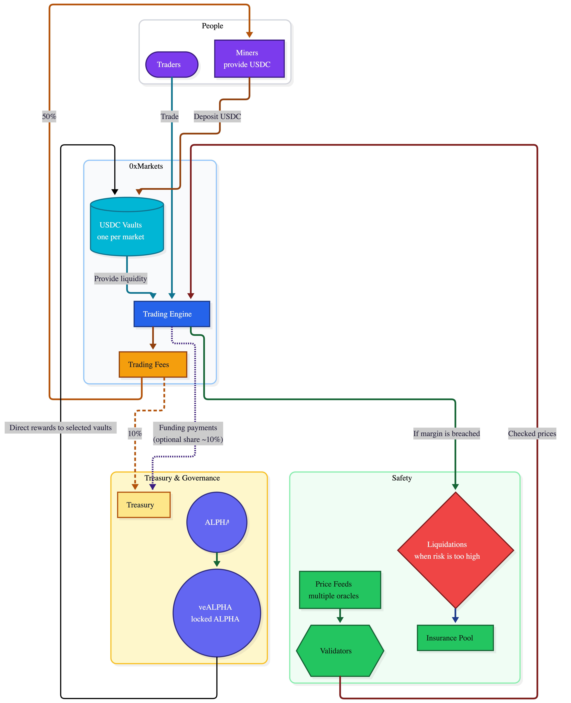

# Litepaper

## Abstract

This litepaper aims to outline the architecture of 0xMarkets powered by the Cartha Subnet. 0xMarkets is a **Multi-asset Decentralized Perpetual Futures Exchange** that offers traders the ability to lever up to 500x on **currencies**, **commodities, crypto** and other RWAs in a perimisionless manner. Liquidity is provided by the **Cartha Subnet (SN35)**, built on Bittensor, where miners act as Liquidity Providers (LPs) for the 0xMarkets DEX.

## Architecture

<figure><figcaption></figcaption></figure>

* **USDC‑only collateral** across markets; **one vault per market** for isolation.
* **External price feeds** from multiple oracles with validator cross‑checks and fallback.
* **Protocol fees:** 10% of trading fees to the treasury; optional treasury share of funding payments.
* **Leverage:** up to **500x**; permissionless onboarding; fixed trading fee structure.

## Cartha Subnet

<figure><figcaption></figcaption></figure>

### Objective

* Operate as the decentralized liquidity backbone for 0xMarkets

### Miner

* Deposit **USDC** into designated liquidity vaults; choose specific vaults/pairs.&#x20;
* Maintain minimum collateral targets (**$200k–$1M over time**)
* Commit funds for weekly epochs (Friday 00:00 UTC → Thursday 23:59 UTC). Lock by **Thursday 23:00 UTC** to ensure the indexer has time to detect your position. See [Weekly Epochs](how-it-works/weekly-epochs.md).
* **Rewards**
  * **ALPHA emissions** by deposit score (time × amount).&#x20;
  * **Trading fees:** **50%** of trading fees to miners.&#x20;

#### Liquidity Provisioning

* Miners choose specific vaults/pairs to support
* Rewards
  * Alpha Rewards
    * Rewards allocated based on a deposit score
    * Deposit score is a function of time and amount staked
  * Trading Fees
    * Earns 50% of trading fees generated by the 0xMarkets protocol

#### Price Provisioning (?)

* External price feeds from multiple oracle providers.
* Validators cross-verify prices to prevent manipulation.
* Redundant fallback oracles for reliability.
* TBC - Confirm if we want to give this to miners

### Validator

* Monitor markets for liquidation events.
* Post Alpha collateral to participate in liquidation execution.
* Slashing penalties for missed liquidations.

#### Liquidations

* Triggered when margin requirements are breached.
* 10% liquidation fee split:
  * 20% to validators.
  * 50% to insurance pool.
  * 30% to Alpha buyback & burn

#### Insurance Pool

* Funded via liquidation fees.
* Covers black swan events and liquidity gaps.
* Governance-controlled deployment.

## DEX

### Liquidity Provisioning

* USDC-only collateral across all markets.
* One vault per market for isolation of risk.

### Traders

* Access to high-leverage perps (up to 500x).
* Permissionless onboarding.
* Fixed trading fee structure.
* **Earn from incentive pool** via weekly leaderboards and IB rebates.

### Trading Fees Distribution

* **50%** to miners (LPs)
* **40%** to veALPHA stakers (pro-rata by ve balance)
* **10%** to protocol treasury (+ optional share of funding payments)

### ALPHA Emission Distribution

* **31%** to miners (LPs) - via vaults based on deposit score
* **41%** to validators - for liquidation execution and maintenance
* **10%** to incentive pool - flexible allocation for ecosystem incentives (airdrops, trading rewards, IB rebates)
* **18%** owner emissions - protocol development

### Staking

* Alpha locking (veAlpha) for governance power.
* Longer locks = higher voting weight and fee share.

### Governance

* **Alpha Voting:** Direct Alpha emissions to specific vaults.
* **Fees Voting:** Adjust fee splits and protocol parameters.
